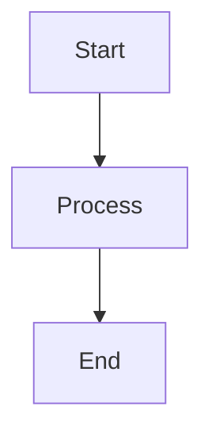
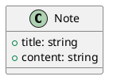

# Creating Notes & Courses

This guide explains how the content is organized and how to add new notes, courses, and branches.

## Content Structure

```
content/
  <branch>/            — e.g., cs, chem, ds
    _branch_.json      — branch metadata (required for discovery)
    <course>/          — e.g., algorithms, thermodynamics
      _course_.json    — course metadata (required for discovery)
      <note>.mdx       — individual notes
      index.mdx        — course index/overview page
```

Each level has a metadata JSON file and the actual notes are `.mdx` files.

---

## Branches

A **branch** is a top-level subject area (Computer Science, Chemical Engineering, etc.).

### Creating a branch

1. Create a directory under `content/`: `content/<branch-id>/`
2. Create `_branch_.json`:

```json
{
  "id": "branch-id",
  "name": "Display Name",
  "description": "Short description of the branch",
  "icon": "📘",
  "order": 1
}
```

| Field | Required | Description |
|---|---|---|
| `id` | yes | URL-safe slug (lowercase, hyphens). Must match the directory name. |
| `name` | yes | Human-readable name shown in the UI |
| `description` | yes | Shown on the home page and branch page |
| `icon` | no | Emoji icon shown on cards |
| `order` | no | Sorting order (lower = first). Defaults to 99. |

Workspace users: creating a branch via the editor automatically generates `_branch_.json`.

---

## Courses

A **course** lives inside a branch and groups related notes together.

### Creating a course

1. Create a directory under the branch: `content/<branch>/<course-id>/`
2. Create `_course_.json`:

```json
{
  "id": "course-id",
  "name": "Display Name",
  "description": "Short description of the course",
  "order": 1
}
```

| Field | Required | Description |
|---|---|---|
| `id` | yes | URL-safe slug. Must match the directory name. |
| `name` | yes | Human-readable name shown in the UI |
| `description` | yes | Shown on the branch page course card |
| `order` | no | Sorting order within the branch. Defaults to 99. |

Workspace users: creating a course via the editor automatically generates `_course_.json`.

---

## Notes

A **note** is a single `.mdx` file inside a course directory.

### Creating a note

Create a file `content/<branch>/<course>/<note-slug>.mdx` with frontmatter:

```mdx
---
title: Note Title
description: Brief summary
date: 2026-06-07
---

# Note Title

Content goes here...
```

| Field | Required | Description |
|---|---|---|
| `title` | yes | Displayed on course page and as the page heading |
| `description` | no | Shown on the course page note list |
| `date` | no | ISO date string |

Notes can also be `index.mdx` — this serves as the course overview page.

### Wiki Links

Link between notes using double-bracket syntax:

```mdx
See [[cs/algorithms/sorting|Sorting Algorithms]] for more details.
```

Format: `[[branch/course/note-slug|Display Text]]`

---

## Diagrams

Several diagram types are supported in `.mdx` files and in the editor preview:

### Mermaid

````mdx

````

### PlantUML

````mdx

````

### Inline SVG

````mdx
```svg
<rect x="10" y="10" width="80" height="40" rx="8" fill="#4ecdc4"/>
```
````

### Interactive Diagrams (YAML)

6 types available via ` ```diagram`:

**Flowchart** — `type: flow` with nodes/edges
**Tree** — `type: tree` with nodes/edges  
**Network** — `type: network` with nodes/edges (force-directed)
**Venn** — `type: venn` with sets/overlaps
**Bar chart** — `type: bar` with bars (label/value)
**Line chart** — `type: line` with series (points)

````mdx
```diagram
type: flow
nodes:
  - id: a
    label: Start
  - id: b
    label: Process
edges:
  - from: a
    to: b
```
````

### 3D Diagrams (static pages only)

For `.mdx` files rendered on static pages (not in the editor preview):

```mdx
<ThreeScene type="surface" data={{ data: [[1,2],[3,4],[5,6]] }} />
<ThreeScene type="scatter3d" data={{ points: [{x:0,y:0,z:0},{x:1,y:1,z:1}] }} />
<ThreeScene type="network3d" data={{ nodes: [{id:"a"}], edges: [] }} />
```

### draw.io (visual editor)

Open the draw.io editor from the workspace toolbar (SVG+ button). Draw visually, click **Export SVG** in the draw.io menu, then **Insert SVG** in the dialog to add the diagram as an ` ```svg ` block.

---

## LaTeX Math

Inline: `$E = mc^2$`

Display:

```mdx
$$
\int_{-\infty}^{\infty} e^{-x^2} dx = \sqrt{\pi}
$$
```

---

## Using the Online Editor

Navigate to `/workspace/<branch>/<course>/<note>` or click the ✏ icon on any page to open the editor.

- **Save Local** — saves to IndexedDB in your browser
- **Commit to GitHub** — pushes to GitHub (requires PAT configuration via ⚙ in sync panel)
- **draw.io** — opens visual diagram editor
- **AI Assistant** — 🤖 button opens AI content generator (Gemini or Ollama)
- **Back** — ← button navigates back to content pages
- **Preview** — toggle live preview of rendered markdown

### Creating content in the workspace

Right-click in the workspace tree to add branches, courses, or files. Files created here are stored locally until pushed to GitHub.

### AI Assistant

Click the 🤖 **AI** button in the editor toolbar to open the AI Assistant dialog:

1. **Select a provider**: Gemini (remote, requires API key) or Ollama (local, requires running server)
2. **Configure the model**:
   - Gemini: paste your API key from [aistudio.google.com/apikey](https://aistudio.google.com/apikey), optionally change the model name
   - Ollama: set the server URL (default `http://localhost:11434`) and model name (e.g., `llama3.2`, `mistral`)
3. **Enter a topic** — describe what you want (e.g., "Binary Search Tree", "HTTP Request Flow")
4. **Choose content type**: Markdown Note, Mermaid Diagram, PlantUML, SVG, or GraphView Chart
5. Optionally add **context** (e.g., course name) for more relevant output
6. Click **Generate**, review the result, then **Insert into Editor**

The API key is stored locally in your browser only. Enable **session-only** mode to clear the key when you close the tab.

### Conflict Resolution

When pulling from GitHub, if the same file was modified both locally and remotely, a conflict dialog appears. Choose **Keep Local**, **Keep Remote**, or **Apply Resolutions** (accepts all changes from both sides, with remote taking priority on line-level conflicts).

### Sync Status

The sync panel (⚙ button) shows:
- **Unsynced files** count — files modified locally but not yet pushed
- **GitHub configuration** status — whether a PAT is configured
- **Push All** / **Pull All** buttons
- **Clear Workspace** — removes all local data (with confirmation dialog)

---

## Adding a New Course via Workspace + Static Build

1. Open the workspace and create the course (right-click branch → New Course)
2. Add notes and edit them in the editor
3. Push to GitHub: click **Push All** in the sync panel
4. Rebuild the site: `npm run build`
5. Deploy

The `_course_.json` file is automatically created when you make a course in the workspace.

---

## Build & Deploy

```bash
npm install         # install dependencies
npm run dev         # dev server at http://localhost:5173
npm run build       # production build + static export to dist/
```

The static export generates HTML files for every content route plus a 404 fallback. Push the `dist/` folder or use the GitHub Actions workflow in `.github/workflows/deploy.yml`.

### Base path

The site builds with `--base=/notes/`. If your repo name differs, update `package.json`:

```json
"build": "vite build --base=/<your-repo-name>/ && node scripts/static-export.mjs"
```
