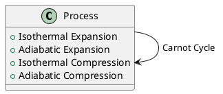

# Laws of Thermodynamics

## Zeroth Law

If two systems are each in thermal equilibrium with a third system, they are in thermal equilibrium with each other.

$$
T_A = T_C \text{ and } T_B = T_C \implies T_A = T_B
$$

## First Law (Conservation of Energy)

Energy cannot be created or destroyed, only converted between forms:

$$\Delta U = Q - W$$

Where:
- $\Delta U$ = change in internal energy
- $Q$ = heat added to the system
- $W$ = work done by the system

## Second Law (Entropy)

The total entropy of an isolated system always increases over time:

$$\Delta S \geq 0$$

Entropy is a measure of disorder:

$$S = k_B \ln \Omega$$

Where $k_B$ is Boltzmann's constant and $\Omega$ is the number of microstates.

## Third Law

As temperature approaches absolute zero, the entropy of a perfect crystal approaches zero:

$$\lim_{T \to 0} S = 0$$

## PlantUML Diagram

The Carnot cycle can be visualized as a plantuml diagram:

## Key Equations

| Concept | Equation |
|---------|----------|
| Ideal Gas | $PV = nRT$ |
| Enthalpy | $H = U + PV$ |
| Gibbs Free Energy | $G = H - TS$ |
| Carnot Efficiency | $\eta = 1 - \frac{T_C}{T_H}$ |

## See Also

- [[chem/thermodynamics/heat-transfer|Heat Transfer]] — the three modes of heat transport
