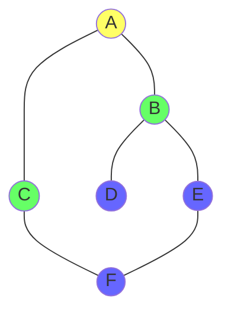

# Graph Algorithms

**Graph algorithms** solve problems on graph data structures (nodes connected by edges).

## Graph Representations

```python
# Adjacency List — most common
graph = {
    'A': ['B', 'C'],
    'B': ['A', 'D', 'E'],
    'C': ['A', 'F'],
    'D': ['B'],
    'E': ['B', 'F'],
    'F': ['C', 'E'],
}

# Adjacency Matrix — dense graphs
#     A  B  C  D  E  F
# A  [0, 1, 1, 0, 0, 0]
# B  [1, 0, 0, 1, 1, 0]
# C  [1, 0, 0, 0, 0, 1]
# D  [0, 1, 0, 0, 0, 0]
# E  [0, 1, 0, 0, 0, 1]
# F  [0, 0, 1, 0, 1, 0]
```

## Breadth-First Search (BFS)

Explores neighbors before descendants. Uses a **queue**. Finds shortest path in unweighted graphs.



```python
from collections import deque

def bfs(graph, start):
    visited = set()
    queue = deque([start])
    visited.add(start)

    while queue:
        node = queue.popleft()
        print(node)
        for neighbor in graph[node]:
            if neighbor not in visited:
                visited.add(neighbor)
                queue.append(neighbor)
```

**BFS order**: A → B → C → D → E → F

## Depth-First Search (DFS)

Explores as far as possible before backtracking. Uses a **stack**.

```python
def dfs(graph, start, visited=None):
    if visited is None:
        visited = set()
    visited.add(start)
    print(start)
    for neighbor in graph[start]:
        if neighbor not in visited:
            dfs(graph, neighbor, visited)
    return visited
```

**DFS order**: A → B → D → E → F → C

## Dijkstra's Algorithm

Finds shortest paths from a source node to all other nodes in a weighted graph.

```python
import heapq

def dijkstra(graph, start):
    distances = {node: float('inf') for node in graph}
    distances[start] = 0
    pq = [(0, start)]

    while pq:
        dist, node = heapq.heappop(pq)
        if dist > distances[node]:
            continue
        for neighbor, weight in graph[node].items():
            new_dist = dist + weight
            if new_dist < distances[neighbor]:
                distances[neighbor] = new_dist
                heapq.heappush(pq, (new_dist, neighbor))

    return distances
```

## Complexity

| Algorithm | Time | Space | Use Case |
|-----------|------|-------|----------|
| BFS | O(V + E) | O(V) | Shortest path (unweighted) |
| DFS | O(V + E) | O(V) | Path finding, cycle detection |
| Dijkstra | O((V+E) log V) | O(V) | Shortest path (weighted) |

## See Also

- [[cs/data-structures/trees|Trees]] — a special case of graphs
- [[cs/algorithms/sorting|Sorting]] — another class of algorithms
