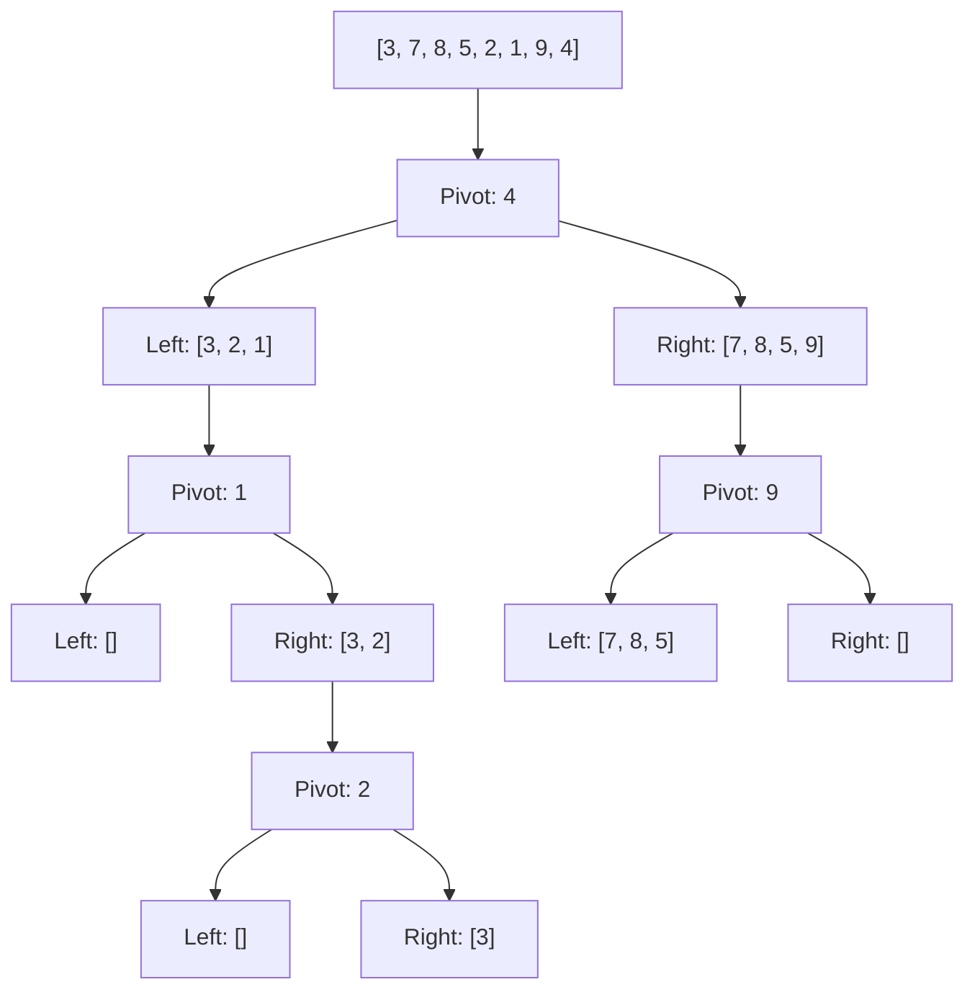

# Sorting Algorithms

**Sorting** arranges elements in a specific order (typically ascending or descending).

## Comparison of Algorithms

| Algorithm | Best | Average | Worst | Space | Stable |
|-----------|------|---------|-------|-------|--------|
| Quick Sort | O(n log n) | O(n log n) | O(n²) | O(log n) | No |
| Merge Sort | O(n log n) | O(n log n) | O(n log n) | O(n) | Yes |
| Heap Sort | O(n log n) | O(n log n) | O(n log n) | O(1) | No |
| Bubble Sort | O(n) | O(n²) | O(n²) | O(1) | Yes |
| Insertion Sort | O(n) | O(n²) | O(n²) | O(1) | Yes |
| Selection Sort | O(n²) | O(n²) | O(n²) | O(1) | No |

## Quick Sort (Divide and Conquer)

```python
def quicksort(arr, low, high):
    if low < high:
        pivot = partition(arr, low, high)
        quicksort(arr, low, pivot - 1)
        quicksort(arr, pivot + 1, high)

def partition(arr, low, high):
    pivot = arr[high]
    i = low - 1
    for j in range(low, high):
        if arr[j] <= pivot:
            i += 1
            arr[i], arr[j] = arr[j], arr[i]
    arr[i + 1], arr[high] = arr[high], arr[i + 1]
    return i + 1
```

## Merge Sort (Divide and Conquer)

```python
def mergesort(arr):
    if len(arr) <= 1:
        return arr
    mid = len(arr) // 2
    left = mergesort(arr[:mid])
    right = mergesort(arr[mid:])
    return merge(left, right)

def merge(left, right):
    result = []
    i = j = 0
    while i < len(left) and j < len(right):
        if left[i] <= right[j]:
            result.append(left[i])
            i += 1
        else:
            result.append(right[j])
            j += 1
    return result + left[i:] + right[j:]
```

## Quick Sort Visualization



## Stability

A sorting algorithm is **stable** if equal elements maintain their relative order:

> *If two items compare as equal, their order in the sorted output matches their order in the input.*

- **Stable**: Merge Sort, Insertion Sort, Bubble Sort
- **Unstable**: Quick Sort, Heap Sort, Selection Sort

## See Also

- [[cs/data-structures/arrays|Arrays]] — what we sort
- [[cs/algorithms/graph-algorithms|Graph Algorithms]] — more advanced problem-solving
