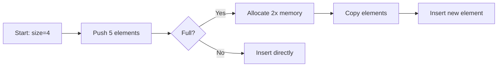

# Arrays

An **array** is a collection of elements stored at contiguous memory locations. Each element can be accessed directly via an index.

## Characteristics

- **Fixed size** (static arrays) or **dynamic** (auto-resizing)
- **Contiguous memory** — cache-friendly
- **Random access** — O(1) time to read/write any element

## Operations

```python
# Creating and using arrays in Python
arr = [1, 2, 3, 4, 5]

# Access — O(1)
first = arr[0]

# Search — O(n)
def linear_search(arr, target):
    for i, val in enumerate(arr):
        if val == target:
            return i
    return -1

# Append (dynamic array) — amortized O(1)
arr.append(6)

# Insert at position — O(n)
arr.insert(2, 10)
```

## Dynamic Array Growth



## Time Complexity

| Operation | Static Array | Dynamic Array |
|-----------|-------------|---------------|
| Access | O(1) | O(1) |
| Search | O(n) | O(n) |
| Insert at end | N/A | O(1)* |
| Insert at middle | N/A | O(n) |
| Delete at end | N/A | O(1) |

*\*Amortized — occasional O(n) when resizing*

## See Also

- [[cs/data-structures/linked-lists|Linked Lists]] — alternative linear structure
- [[cs/data-structures/trees|Trees]] — hierarchical structures
