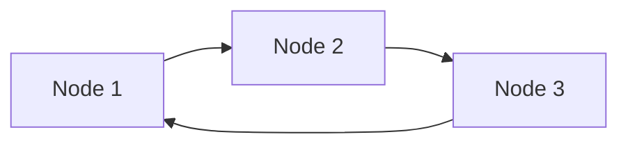

# Linked Lists

A **linked list** is a linear data structure where elements are stored in nodes, each containing a reference (link) to the next node.

## Types

### Singly Linked List
Each node points to the next node only.

```
[Head] → [Node 1] → [Node 2] → [Node 3] → null
```

### Doubly Linked List
Each node points to both next and previous nodes.

```
null ← [Node 1] ⇄ [Node 2] ⇄ [Node 3] → null
```

### Circular Linked List
The last node points back to the first.



## Implementation

```python
class Node:
    def __init__(self, data):
        self.data = data
        self.next = None

class LinkedList:
    def __init__(self):
        self.head = None

    def insert_at_head(self, data):
        node = Node(data)
        node.next = self.head
        self.head = node

    def delete_at_head(self):
        if not self.head:
            return None
        data = self.head.data
        self.head = self.head.next
        return data

    def search(self, target):
        current = self.head
        while current:
            if current.data == target:
                return True
            current = current.next
        return False
```

## Advantages

- Dynamic size — grows and shrinks at runtime
- Efficient insertions/deletions at head — O(1)
- No memory waste from pre-allocation

## Disadvantages

- No random access — O(n) to find an element
- Extra memory per node for pointers
- Not cache-friendly (non-contiguous memory)

## Trade-off vs Arrays

| Aspect | Arrays | Linked Lists |
|--------|--------|-------------|
| Memory | Contiguous | Scattered |
| Access | O(1) index | O(n) traverse |
| Insert head | O(n) shift | O(1) |
| Memory/Element | Just data | Data + pointer(s) |

## See Also

- [[cs/data-structures/arrays|Arrays]] — comparison with contiguous storage
- [[cs/data-structures/trees|Trees]] — generalization of linked lists
