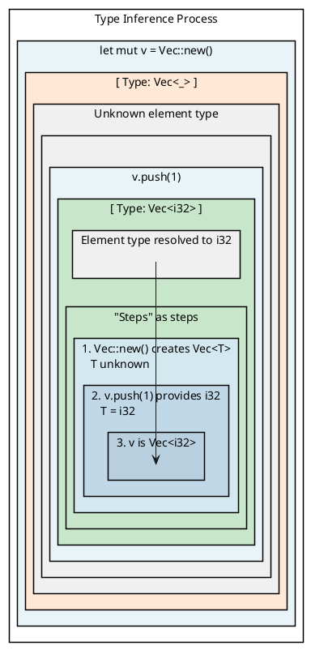
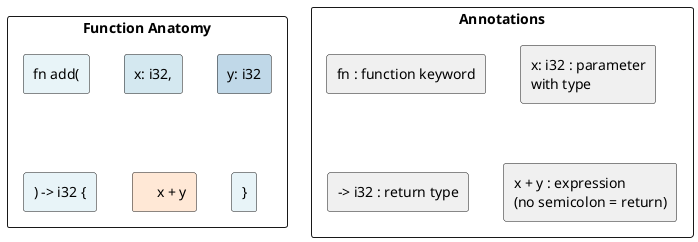
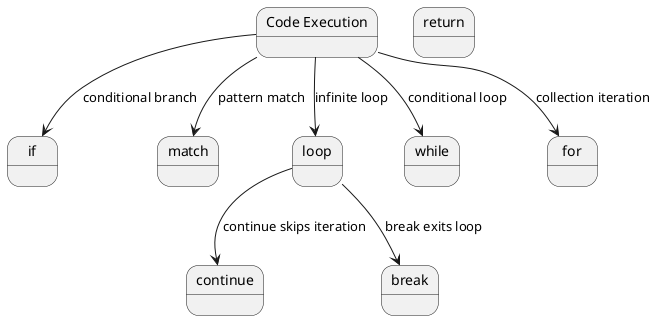

# Rust Fundamentals

## Overview

Rust is a **statically typed** language — all types are known at compile time. But the compiler can infer types most of the time.

---

## 1. Variables and Mutability

### let Bindings

Variables are **immutable by default**:

```rust
let x = 5;
// x = 6;  // ERROR: cannot assign twice to immutable variable
```

Make a variable mutable with `mut`:

```rust
let mut x = 5;
x = 6;  // OK
```

### Shadowing

You can redeclare a variable with the same name:

```rust
let x = 5;
let x = x + 1;  // Shadows previous x
let x = x * 2;  // Shadows again
println!("{}", x);  // 12
```

Shadowing differs from `mut` because:
- We can change the **type** of the variable
- We can change **mutability**

```rust
let spaces = "   ";        // &str
let spaces = spaces.len(); // usize — type changed!
```

---

## 2. Data Types

### Scalar Types

| Type | Kind | Size | Example |
|------|------|------|---------|
| `i8`, `i16`, `i32`, `i64`, `i128` | Signed integers | 1–16 bytes | `let x: i32 = -42;` |
| `u8`, `u16`, `u32`, `u64`, `u128` | Unsigned integers | 1–16 bytes | `let y: u32 = 42;` |
| `f32`, `f64` | Floating point | 4/8 bytes | `let z: f64 = 3.14;` |
| `bool` | Boolean | 1 byte | `let b = true;` |
| `char` | Unicode character | 4 bytes | `let c = '🦀';` |

### Integer Literals

```rust
let decimal = 98_222;      // 98222
let hex = 0xff;            // 255
let octal = 0o77;          // 63
let binary = 0b1111_0000;  // 240
let byte = b'A';           // 65 (u8 only)
```

### Compound Types

**Tuples:**

```rust
let tup: (i32, f64, u8) = (500, 6.4, 1);
let (x, y, z) = tup;  // Destructuring

// Access by index:
let first = tup.0;   // 500
let second = tup.1;  // 6.4
```

**Arrays:**

```rust
let a = [1, 2, 3, 4, 5];           // [i32; 5]
let first = a[0];                   // Access
let months = ["Jan", "Feb", "Mar"]; // &str array
let zeros = [0; 5];                 // [0, 0, 0, 0, 0]
```

Arrays are **fixed-length** and **stack-allocated**. For dynamic arrays, use `Vec`.

---

## 3. Type Inference

Rust infers types from usage:

```rust
let x = 42;             // i32 (default)
let y = 3.14;           // f64 (default)
let z: i64 = 100;       // explicit annotation
let arr = [1, 2, 3];    // [i32; 3]
```

The inference algorithm works across statements:

```rust
let mut v = Vec::new();  // Vec<_>, type unknown yet
v.push(1);               // Now inferred as Vec<i32>
```



---

## 4. Constants

```rust
const MAX_POINTS: u32 = 100_000;
const PI: f64 = 3.1415926535;
```

- Always immutable
- Type **must** be annotated
- Can be declared in any scope
- Evaluated at compile time

---

## 5. Functions

```rust
fn add(x: i32, y: i32) -> i32 {
    x + y  // No semicolon = expression = return value
}

fn main() {
    let result = add(5, 3);
    println!("{}", result);  // 8
}
```

### Function Anatomy



### Statements vs Expressions

- **Statements** — perform an action, do not return a value
- **Expressions** — evaluate to a value

```rust
let y = {
    let x = 3;       // statement
    x + 1             // expression (no semicolon)
};  // y = 4
```

---

## 6. Control Flow

### if / else if / else

```rust
let number = 6;

if number % 4 == 0 {
    println!("divisible by 4");
} else if number % 3 == 0 {
    println!("divisible by 3");
} else {
    println!("not divisible by 4 or 3");
}
```

`if` is an **expression**:

```rust
let condition = true;
let number = if condition { 5 } else { 6 };  // number = 5
```

### Loops

**loop (infinite):**

```rust
let mut counter = 0;
let result = loop {
    counter += 1;
    if counter == 10 {
        break counter * 2;  // returns 20
    }
};
```

**while:**

```rust
let mut n = 3;
while n != 0 {
    n -= 1;
}
```

**for (most common):**

```rust
let a = [10, 20, 30];

for element in a {
    println!("{}", element);
}

// Range:
for n in 1..=5 {
    println!("{}", n);  // 1, 2, 3, 4, 5
}
```

---

## 7. Pattern Matching with match

```rust
let x = 1;

match x {
    1 => println!("one"),
    2 => println!("two"),
    3 => println!("three"),
    _ => println!("anything"),  // Wildcard
}
```

`match` is **exhaustive** — every possible value must be covered.

### Matching with Enums

```rust
enum Coin {
    Penny,
    Nickel,
    Dime,
    Quarter,
}

fn value_in_cents(coin: Coin) -> u8 {
    match coin {
        Coin::Penny => 1,
        Coin::Nickel => 5,
        Coin::Dime => 10,
        Coin::Quarter => 25,
    }
}
```

### if let

Shorthand for matching one pattern:

```rust
let config_max = Some(3u8);
if let Some(max) = config_max {
    println!("{}", max);
}
// Equivalent to:
match config_max {
    Some(max) => println!("{}", max),
    _ => (),
}
```

---

## 8. Destructuring

### Destructuring Tuples

```rust
let (x, y, z) = (1, 2, 3);
println!("{} {} {}", x, y, z);  // 1 2 3

// Ignore with _
let (first, _, third) = (1, 2, 3);
```

### Destructuring Structs

```rust
struct Point { x: i32, y: i32 }

let p = Point { x: 0, y: 7 };
let Point { x, y } = p;
println!("({}, {})", x, y);

// Rename:
let Point { x: a, y: b } = p;
```

### Destructuring Function Parameters

```rust
fn print_coords(&(x, y): &(i32, i32)) {
    println!("({}, {})", x, y);
}
```

---

## 9. Type Aliases

```rust
type Kilometers = i32;
let distance: Kilometers = 5;
```

Useful for shortening long types:

```rust
type Result<T> = std::result::Result<T, std::io::Error>;
```

---

## 10. Control Flow Transitions



---

## Key Takeaways

| Concept | Code |
|---------|------|
| **Immutable variable** | `let x = 5;` |
| **Mutable variable** | `let mut x = 5;` |
| **Shadowing** | `let x = x + 1;` |
| **Tuple** | `let t = (1, "hello", 3.14);` |
| **Array** | `let a = [1, 2, 3];` |
| **Function** | `fn f(x: i32) -> i32 { x + 1 }` |
| **if expression** | `let n = if c { a } else { b };` |
| **for loop** | `for i in 0..10 {}` |
| **match** | `match x { 1 => "one", _ => "other" }` |

---

**Next:** [[cs/rust/03-memory-management|Memory Management]] — Stack vs heap, ownership, moves, clones
