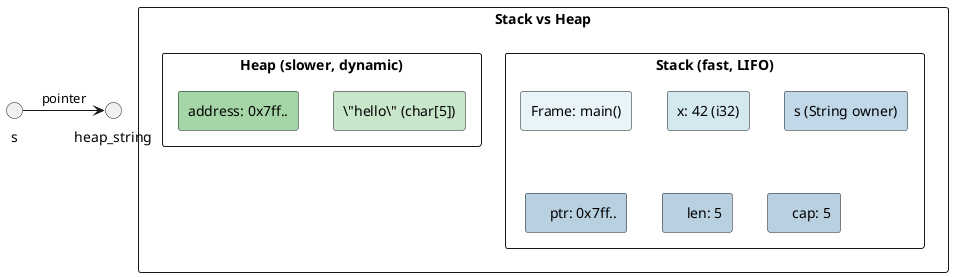
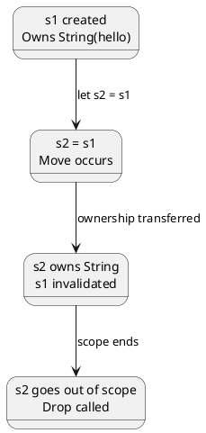
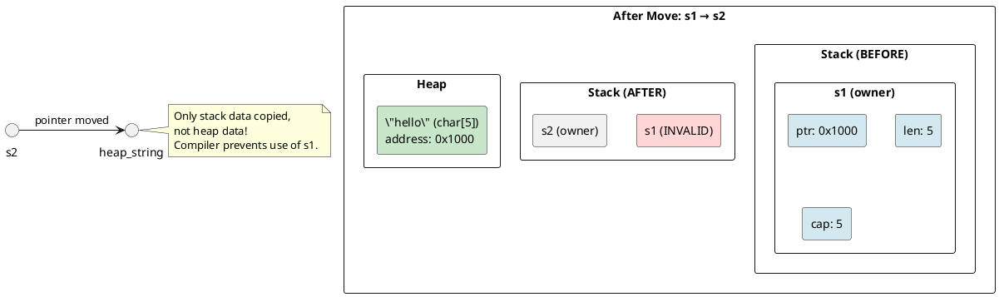
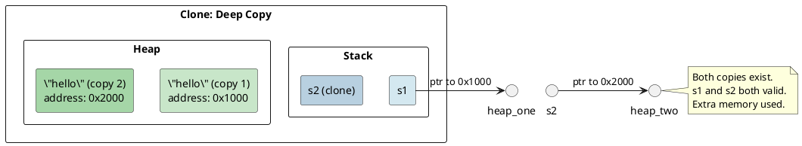
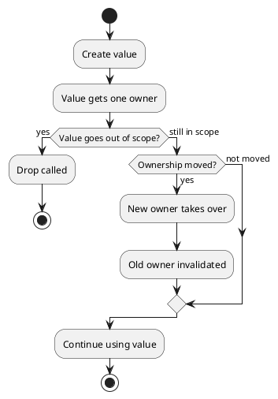
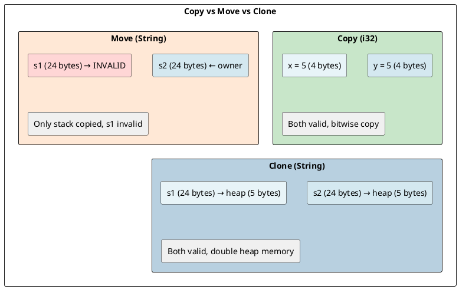

# Memory Management: Ownership Under the Hood

## Overview

Rust's memory model is built on the **ownership system**:

- **Each value has exactly one owner**
- **Ownership can be transferred** (moved)
- **When the owner goes out of scope, the value is dropped**

---

## 1. The Stack and the Heap

### Stack

- **LIFO** (Last In, First Out)
- **Fast** — push/pop, no bookkeeping
- **Fixed-size** data only
- Stores: local variables, function frames

### Heap

- **Arbitrary allocation/deallocation**
- **Slower** — malloc, bookkeeping, potential fragmentation
- **Dynamic-size** data
- Stores: `String`, `Vec`, `Box`, etc.



### Allocation sizes

```rust
println!("{}", std::mem::size_of::<i32>());        // 4
println!("{}", std::mem::size_of::<&str>());        // 16 (ptr + len)
println!("{}", std::mem::size_of::<String>());      // 24 (ptr + len + cap)
println!("{}", std::mem::size_of::<Vec<i32>>());    // 24 (ptr + len + cap)
println!("{}", std::mem::size_of::<Box<i32>>());    // 8 (pointer)
```

---

## 2. Ownership Rules

### Rule 1: Each value has exactly one owner

```rust
let s1 = String::from("hello");  // s1 owns the String
let s2 = s1;                      // Ownership moves to s2
// println!("{}", s1);            // ERROR: s1 no longer valid
```

### Rule 2: When owner goes out of scope, value is dropped

```rust
{
    let s = String::from("hello");
    // s owns the String
}  // scope ends → drop() called → heap memory freed
```

### Ownership Flow



---

## 3. Move Semantics

### What Happens During a Move?

```rust
let s1 = String::from("hello");
let s2 = s1;
```

**Memory layout after move:**



### Move in Functions

```rust
fn takes_ownership(s: String) {
    println!("{}", s);
}  // s dropped here

let s = String::from("hello");
takes_ownership(s);  // s moved into function
// println!("{}", s);  // ERROR
```

### Move also applies to return values

```rust
fn gives_ownership() -> String {
    let s = String::from("hello");
    s  // ownership moves out
}

let s1 = gives_ownership();  // receives ownership
```

---

## 4. Copy Types

### The Copy Trait

Types that implement **Copy** are not moved — they are **bitwise copied**:

```rust
let x = 5;      // i32 is Copy
let y = x;      // x is copied, not moved
println!("{}", x);  // OK
```

### Common Copy Types

| Type | Example |
|------|---------|
| All integer types | `i32`, `u64`, etc. |
| Floating point | `f32`, `f64` |
| Boolean | `bool` |
| Character | `char` |
| Tuples of Copy types | `(i32, i32)` |
| Arrays of Copy types | `[i32; 5]` |

### Not Copy (Move semantics)

| Type | Example |
|------|---------|
| `String` | heap-allocated |
| `Vec<T>` | heap-allocated |
| `Box<T>` | heap-allocated |
| `&mut T` | mutable reference |
| Owned structs | (not Copy) |

---

## 5. Clone

### The Clone Trait

```rust
let s1 = String::from("hello");
let s2 = s1.clone();  // deep copy of heap data

println!("s1: {}, s2: {}", s1, s2);  // Both valid
```



### Clone vs Copy

| | `Copy` | `Clone` |
|---|---|---|
| **Implicit** | Yes (on assignment) | No (must call .clone()) |
| **Cost** | Cheap (bitwise) | Potentially expensive |
| **Heap data** | No | Yes |
| **Trait bound** | `Copy` | `Clone` |

---

## 6. The Drop Trait

### Automatic Cleanup

```rust
struct MyStruct;

impl Drop for MyStruct {
    fn drop(&mut self) {
        println!("Dropping MyStruct!");
    }
}

{
    let _s = MyStruct;
}  // "Dropping MyStruct!" printed here
```

### Drop Order

Variables are dropped in **reverse declaration order** (last in, first out):

```rust
let s1 = String::from("first");
let s2 = String::from("second");
// s2 dropped first, then s1
```

### RAII (Resource Acquisition Is Initialization)

Rust uses RAII — resources are acquired at construction and released at destruction:

```rust
{
    let file = std::fs::File::open("test.txt");
    // file is opened
}  // file is automatically closed here
```

---

## 7. Ownership Transfer in Practice

### Borrowing via References (No Transfer)

```rust
fn calculate_length(s: &String) -> usize {
    s.len()
}  // s (reference) goes out of scope, NOT the String

let s = String::from("hello");
let len = calculate_length(&s);  // s still valid
println!("{} {}", s, len);
```

### Mutable References

```rust
fn modify(s: &mut String) {
    s.push_str(" world");
}

let mut s = String::from("hello");
modify(&mut s);
println!("{}", s);  // "hello world"
```

---

## 8. Ownership Rules Flowchart



---

## 9. Common Pitfalls

### Pitfall 1: Using after move

```rust
let v = vec![1, 2, 3];
let v2 = v;
// println!("{:?}", v);  // ERROR
```

Fix: Use `v.clone()` or restructure code.

### Pitfall 2: Double free (impossible in Rust)

```rust
// In C++ — UNSAFE:
// delete ptr;
// delete ptr;  // double free!

// In Rust — impossible due to ownership:
let s = String::from("hello");
// Only one owner, drop called exactly once
```

### Pitfall 3: Partial moves

```rust
struct Person {
    name: String,
    age: u32,
}

let p = Person {
    name: String::from("Alice"),
    age: 30,
};

let name = p.name;  // Partial move
// println!("{}", p.name);  // ERROR
println!("{}", p.age);  // OK — age not moved
```

---

## 10. Memory Layout Comparison



---

## Key Takeaways

1. **Ownership**: Each value has exactly one owner
2. **Move**: Ownership transfer invalidates the original
3. **Copy**: Bitwise copy (cheap, implicit)
4. **Clone**: Deep copy (potentially expensive, explicit)
5. **Drop**: Automatic cleanup when owner goes out of scope
6. **Stack**: Fast, fixed-size, LIFO
7. **Heap**: Slow, dynamic, managed via ownership

---

**Next:** [[cs/rust/04-borrowing-references|Borrowing & References]] — The borrow checker under the hood
