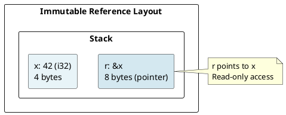
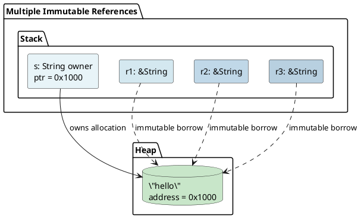
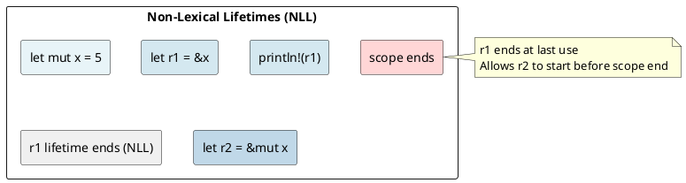
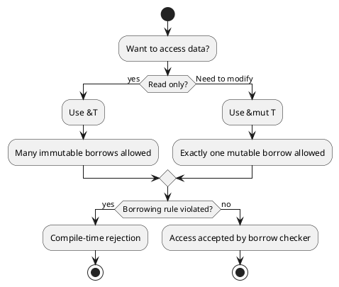

# Borrowing & References: The Borrow Checker Under the Hood

## Overview

The **borrow checker** is Rust's compiler pass that prevents data races and use-after-free bugs by enforcing borrowing rules at compile-time. No runtime overhead — pure static analysis.

---

## 1. The Three Rules of References

### Rule 1: You Can Have Many Immutable References OR One Mutable Reference

```rust
// Many immutable references: OK
let s = String::from("hello");
let r1 = &s;
let r2 = &s;
let r3 = &s;
println!("{}, {}, {}", r1, r2, r3);

// One mutable reference: OK
let mut s = String::from("hello");
let r = &mut s;
r.push_str(" world");

// Mixed: NOT OK
let mut s = String::from("hello");
let r1 = &s;        // Immutable borrow
let r2 = &mut s;    // ERROR: cannot borrow as mutable
```

### Rule 2: References Must Not Outlive the Referent

```rust
fn dangling() -> &String {
    let s = String::from("hello");
    &s  // ERROR: returns reference to local variable
}   // s is dropped here
```

### Rule 3: No Mutable Alias

```rust
let mut s = String::from("hello");
let r1 = &mut s;
let r2 = &mut s;  // ERROR: cannot borrow twice as mutable
```

---

## 2. Immutable References (&T)

### How &T Works

An immutable reference is a **read-only pointer**:

```rust
let x = 42;
let r = &x;        // Reference to x
println!("{}", r); // Dereference and read
```

**Memory layout:**



### Multiple Immutable References

```rust
let s = String::from("hello");
let r1 = &s;
let r2 = &s;
let r3 = &s;

// All point to same data
println!("{} {} {}", r1, r2, r3);
```

**Why allow many?** Multiple readers don't conflict. The data is **shared and immutable**.

**Stack layout:**



---

## 3. Mutable References (&mut T)

### How &mut T Works

A mutable reference is a **read-write pointer with exclusive access**:

```rust
let mut x = 42;
let r = &mut x;
*r = 100;  // Dereference and write
println!("{}", x);  // 100
```

### No Mutable Aliases

```rust
let mut s = String::from("hello");
let r1 = &mut s;
r1.push_str(" world");

let r2 = &mut s;  // ERROR: cannot borrow as mutable while r1 exists
```

**Why?** If two mutable references existed simultaneously:

```rust
// Hypothetical (invalid) code:
let mut s = String::from("hello");
let r1 = &mut s;
let r2 = &mut s;

r1.push_str("!");  // r1 modifies data
r2.push_str("?");  // r2 also modifies data
                   // Which one wins? Race condition!
```

The compiler **prevents this at compile-time**.

---

## 4. The Borrow Checker Algorithm

### Lifetime-Based Analysis

The borrow checker assigns each reference a **lifetime** (scope):

```rust
let x = 5;             // 'static (or 'a if in function)
let r = &x;            // Lifetime must be <= x's lifetime
println!("{}", r);
```

### Non-Lexical Lifetimes (NLL)

Modern Rust uses **Non-Lexical Lifetimes** (Rust 2018+): a reference's lifetime ends at its last use, not at scope end.

```rust
let mut x = 5;

let r1 = &x;      // Borrow starts
println!("{}", r1);  // Last use of r1
                  // r1's lifetime ends here!

let r2 = &mut x;  // OK! r1 is no longer active
r2 = &mut x;
```

**Timeline:**

```
Scope:
│ let mut x = 5;
│ │
│ │ let r1 = &x;     ─── r1 lifetime starts
│ │ println!("{}", r1);  r1's last use
│ │ ─── r1 lifetime ends (NLL)
│ │
│ │ let r2 = &mut x;  ─── r2 lifetime starts (no conflict!)
│ │ r2 = &mut x;         (still valid)
│ │ ─── r2 lifetime ends
│
└─ scope ends
```



---

## 5. Mutable References and Exclusivity

### The Core Principle

At any point in time, for any piece of data:
- **Either** multiple immutable references exist
- **Or** exactly one mutable reference exists
- **But not both**

### Checking at Compile Time

```rust
fn check_refs() {
    let mut s = String::from("hello");

    let r1 = &s;              // Immutable borrow
    let r2 = &s;              // Immutable borrow (OK, same type)

    println!("{} {}", r1, r2);  // r1, r2 last used here
                                // Their lifetimes end

    let r3 = &mut s;          // Mutable borrow (OK, no other refs active)
    r3.push_str("!");
}
```

**Borrow timeline:**

```
     r1 ──────┐
     r2 ──────┤  (both immutable, OK)
              │
     r3 ─────────┐ (mutable, no conflict with r1/r2)
```

---

## 6. Borrow Checker Error Examples

### Error: Borrow After Mutable Borrow

```rust
let mut s = String::from("hello");
let r1 = &mut s;      // Mutable borrow
r1.push_str(" world");

let r2 = &s;          // ERROR: cannot borrow as immutable
                      // (r1's mutable borrow still active)
println!("{} {}", r1, r2);
```

### Error: Mutable Borrow After Use

```rust
let mut s = String::from("hello");
let r1 = &s;          // Immutable borrow
println!("{}", r1);   // Last use of r1

let r2 = &mut s;      // OK (NLL)! r1 is no longer used
r2.push_str("!");
```

**With NLL:** Actually OK! Because `r1` is no longer used after the println.

---

## 7. Dereference Coercion

### Automatic Dereferencing

The compiler automatically dereferences references in certain contexts:

```rust
let s = String::from("hello");
let r = &s;

// Manual dereference:
let len = (*r).len();

// Automatic deref coercion:
let len = r.len();  // Same thing!
```

**Compiler does this:**

```
r.len()
  → (*r).len()           (dereference)
  → (&s).len()           (r points to s)
  → String::len(&s)      (method call)
```

### Deref Coercion for Functions

```rust
fn takes_str(s: &str) {}

let s = String::from("hello");
takes_str(&s);     // Deref: &String → &str
```

---

## 8. Lifetime Annotations (Introduction)

### Why Lifetimes?

When a function returns a reference, the compiler must verify the reference is valid:

```rust
fn first_word(s: &String) -> &str {
    let words: Vec<&str> = s.split(' ').collect();
    &words[0]  // ERROR: returns reference to local variable!
}
```

### Explicit Lifetime Parameters

```rust
fn longest<'a>(x: &'a str, y: &'a str) -> &'a str {
    if x.len() > y.len() { x } else { y }
}
```

The lifetime `'a` means: "the returned reference is valid as long as both `x` and `y` are valid."

**Memory safety:** If `x` or `y` goes out of scope before the returned reference is used, the compiler catches it.

→ See [[cs/rust/06-lifetimes|Lifetimes]] for deep dive.

---

## 9. Borrowing Rules Summary

| Type | Mutability | Quantity | Last Use Matters? |
|------|-----------|----------|------------------|
| `&T` | No | Many | Yes (NLL) |
| `&mut T` | Yes | One | Yes (NLL) |
| Owned | (owned) | One | No |

### Borrowing Rules Flowchart



---

## 10. Reference Types Compared

```rust
let x = 42;

// Immutable reference (4 scenarios)
let r1: &i32 = &x;        // Type: &i32
let r2 = &x;              // Same, inferred

// Mutable reference (requires x is mut)
let mut y = 42;
let r3: &mut i32 = &mut y;  // Type: &mut i32

// Pointer in unsafe code
let ptr: *const i32 = &x;   // Raw pointer (no safety!)
let mut_ptr: *mut i32 = &mut y;  // Mutable raw pointer
```

| Type | Safety | Exclusivity | Auto-deref |
|------|--------|------------|-----------|
| `&T` | ✓ Checked | Multiple OK | ✓ Yes |
| `&mut T` | ✓ Checked | Exclusive | ✓ Yes |
| `*const T` | ✗ Unsafe | None | ✗ No |
| `*mut T` | ✗ Unsafe | None | ✗ No |

---

## 11. Example: Building a Safe Function

```rust
fn append_exclamation(s: &mut String) {
    s.push('!');  // Requires &mut for modification
}

fn greet(name: &str) {  // Borrows, doesn't modify
    println!("Hello, {}!", name);
}

let mut msg = String::from("hello");
greet(&msg);              // Immutable borrow ✓
append_exclamation(&mut msg);  // Mutable borrow ✓
greet(&msg);              // Immutable borrow ✓
```

**Borrow timeline:**

```
greet(&msg)     ──┐
                  ├─ (non-overlapping, all OK)
append_exclamation(&mut msg) ──┤
                  │
greet(&msg)     ──┘
```

---

## Key Takeaways

1. **Immutable refs (`&T`)**: Read-only, many allowed
2. **Mutable refs (`&mut T`)**: Read-write, exclusive access
3. **Borrow checker**: Enforces rules at compile-time
4. **NLL**: References end at last use, not scope end
5. **Lifetimes**: Explicit when returning references

---

**Next:** [[cs/rust/05-function-execution|Function Execution]] — Understand the call stack
