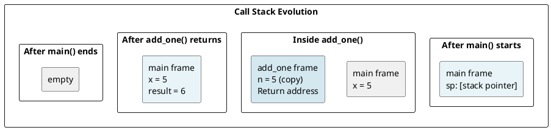
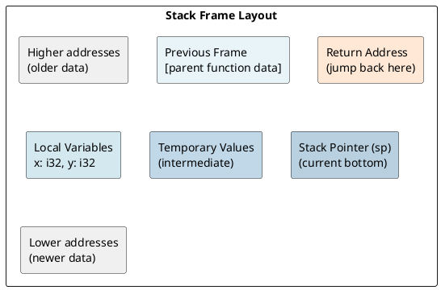
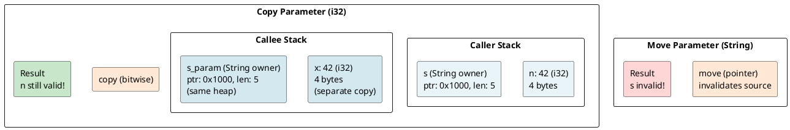
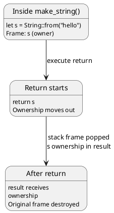
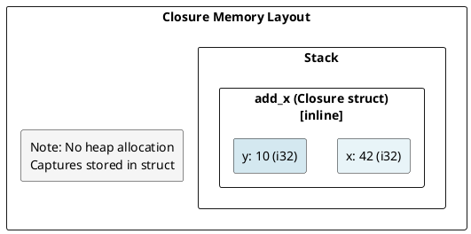
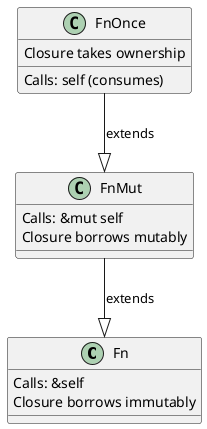
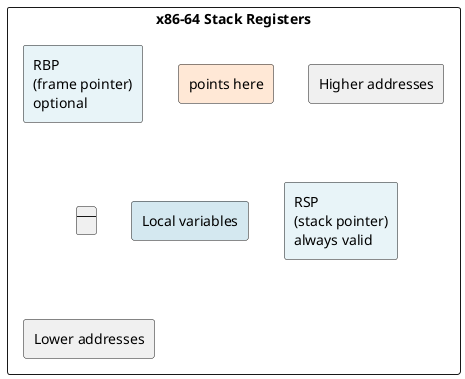
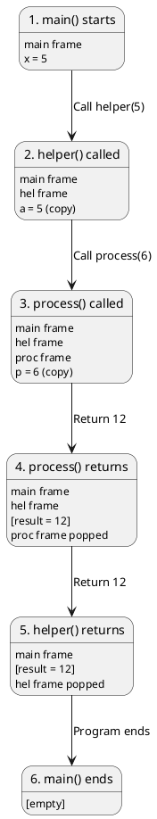

# Function Execution & Call Stack: Under the Hood

## Overview

Understanding how functions execute in Rust means knowing how the call stack grows, how parameters are passed, and how return values are handled — all with ownership semantics baked in.

---

## 1. The Call Stack

### What is the Call Stack?

The **call stack** is a LIFO (Last-In-First-Out) data structure that tracks **stack frames** — one for each active function call.

```rust
fn main() {
    let x = 5;
    add_one(x);  // new frame pushed
    // add_one frame popped
}

fn add_one(n: i32) -> i32 {
    n + 1  // frame active while this executes
}
```

**Stack evolution:**



---

## 2. Stack Frames

### Frame Layout (x86-64)

Each stack frame contains:
1. **Local variables** - allocated in order
2. **Temporary values** - intermediate computations
3. **Return address** - where to jump after function ends
4. **Previous frame pointer** (optional) - for debugging



---

## 3. Parameter Passing

### Move vs Copy for Parameters

```rust
fn process_copy(x: i32) {
    println!("{}", x);
}  // i32 is Copy

fn process_move(s: String) {
    println!("{}", s);
}  // String is NOT Copy, ownership moves

let n = 42;
process_copy(n);  // Copy: n still valid

let s = String::from("hello");
process_move(s);  // Move: s is invalid after call
```

**Parameter passing mechanism:**



---

## 4. Return Values and Move Semantics

### Returning Owned Values

```rust
fn make_string() -> String {
    let s = String::from("hello");
    s  // Ownership moves out
}  // s is NOT dropped here (moved)

let result = make_string();  // Receive ownership
```

**Stack during return:**



### Return Value Optimization (RVO)

Modern Rust compilers apply **Return Value Optimization**:

```rust
fn expensive() -> String {
    String::from("hello world")
}

let s = expensive();  // Compiler may avoid extra copy
```

**With RVO (optimized):**
```
1. Caller allocates space for return value
2. Callee builds String in that space
3. No move/copy needed
```

---

## 5. Closures and Their Memory Layout

### What is a Closure?

A closure is a function that **captures variables from its environment**.

```rust
let x = 42;
let y = 10;

let add_x = |z: i32| {
    x + y + z  // Captures x and y
};

add_x(5);  // 42 + 10 + 5 = 57
```

### Closure Representation

The compiler translates a closure into a **struct** with captured variables + `FnOnce`, `FnMut`, or `Fn` trait:

```rust
// Original closure:
let add_x = |z| x + y + z;

// Compiler generates (approximately):
struct Closure {
    x: i32,  // captured by value
    y: i32,  // captured by value
}

impl Fn<(i32,)> for Closure {
    extern "rust-call" fn call(&self, args: (i32,)) -> i32 {
        self.x + self.y + args.0
    }
}
```

**Memory layout:**



### Capture Types

```rust
let x = 42;

// 1. Capture by immutable reference (&T)
let borrow = || println!("{}", x);

// 2. Capture by mutable reference (&mut T)
let mut y = 10;
let borrow_mut = || y += 1;

// 3. Capture by value (move)
let owned = move || { x + 1 };  // owns x
```

**Trait implementation based on captures:**



---

## 6. Function Pointers vs Closures

### Function Pointers (fn)

```rust
fn add(a: i32, b: i32) -> i32 {
    a + b
}

let f: fn(i32, i32) -> i32 = add;  // Function pointer
f(3, 5);  // Calls add
```

**Size comparison:**

```rust
fn simple_fn(x: i32) -> i32 { x + 1 }

let fn_ptr: fn(i32) -> i32 = simple_fn;
println!("{}", std::mem::size_of_val(&fn_ptr));  // 8 bytes

let x = 10;
let closure = |y: i32| x + y;
println!("{}", std::mem::size_of_val(&closure));  // 4 bytes (just x)

let closure2 = |y: i32| simple_fn(y) + 1;
println!("{}", std::mem::size_of_val(&closure2));  // 0 bytes (no capture!)
```

---

## 7. Tail Call Optimization (TCO)

### Is Tail Call Optimized?

Rust **does NOT guarantee** tail call optimization, but the compiler may apply it.

```rust
fn factorial(n: u32, acc: u32) -> u32 {
    if n == 0 {
        acc
    } else {
        factorial(n - 1, acc * n)  // Tail call
    }
}
```

**Without TCO (new frame each call):**
```
factorial(5, 1)
  factorial(4, 5)
    factorial(3, 20)
      factorial(2, 60)
        factorial(1, 120)
          factorial(0, 120)  ← returns

Stack depth: 6 frames
```

**With TCO (frame reused):**
```
Same function, same frame, just update registers
Stack depth: 1 frame
```

**Current Rust (1.75):** TCO is not guaranteed. Use **iterative** code for guaranteed stack efficiency:

```rust
fn factorial_iter(n: u32) -> u32 {
    (1..=n).product()  // No recursion
}
```

---

## 8. Inline Functions

### #[inline] Attribute

The `#[inline]` attribute suggests the compiler substitute the function body at the call site:

```rust
#[inline]
fn add_one(x: i32) -> i32 {
    x + 1
}

let result = add_one(42);
```

**Without inline (with function call):**
```
1. Push stack frame
2. Copy parameter
3. Execute function body
4. Pop stack frame
5. Return to caller
```

**With inline (inlined):**
```
1. Substitute: result = 42 + 1
2. No function call overhead
```

### Inline Hints

```rust
#[inline]        // Suggest inline (compiler decides)
#[inline(always)]  // Force inline (rarely needed)
#[inline(never)]   // Prevent inline

pub fn ...
```

---

## 9. The Stack Pointer and Frame Pointer

### x86-64 Registers

- **RSP** (stack pointer) - points to top of stack
- **RBP** (frame/base pointer) - points to current frame's base (optional)



Modern Rust often omits RBP to save a register.

---

## 10. Example: Complete Stack Trace

```rust
fn main() {
    let x = 5;
    let y = helper(x);
    println!("{}", y);
}

fn helper(a: i32) -> i32 {
    let b = a + 1;
    process(b)
}

fn process(p: i32) -> i32 {
    p * 2
}
```

**Stack evolution:**



---

## 11. Performance: Stack vs Heap

```
Stack allocation: O(1), just move RSP
Heap allocation: O(n), malloc + initialize

Stack access: Cache-friendly, predictable
Heap access: Pointer chase, potential cache miss

Stack: Automatic cleanup (scope exit)
Heap: Manual or via Drop trait
```

**Rule of thumb:** Use stack when possible, heap for large/dynamic data.

---

## 12. Debugging: Stack Frames

View the call stack during debugging:

```rust
use std::backtrace::Backtrace;

fn crash_here() {
    let bt = Backtrace::capture();
    println!("{}", bt);  // Print full call stack
}
```

Output shows:
- Each function in the call chain
- Memory addresses (useful for binary inspection)
- Source line numbers (if debug info available)

---

## Key Takeaways

| Concept | Mechanism |
|---------|-----------|
| **Call Stack** | LIFO stack of frames tracking execution |
| **Stack Frame** | Contains locals, return address, temp values |
| **Parameters** | Copied (Copy types) or moved (non-Copy types) |
| **Return Values** | Moved to caller (RVO may optimize) |
| **Closures** | Compiled to structs with captured variables |
| **Inlining** | Optional optimization to avoid call overhead |
| **Tail Calls** | NOT guaranteed optimized in Rust |

---

**Next:** [[cs/rust/06-lifetimes|Lifetimes]] — Understand lifetime parameters and their enforcement
