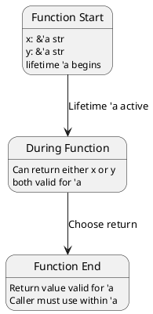
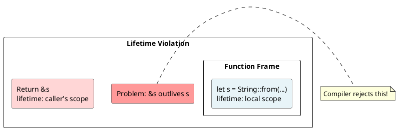
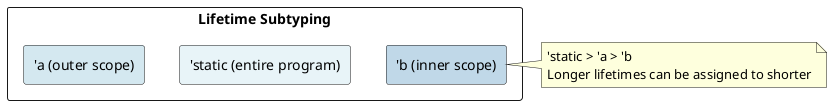

# Lifetimes: Under the Hood

## Overview

**Lifetimes** are compile-time annotations that describe relationships between references. They don't add runtime overhead — they're purely for the compiler's borrow checker.

---

## 1. What is a Lifetime?

### Lifetime Basics

A lifetime is a **scope during which a reference is valid**:

```rust
let x = 5;
{
    let r = &x;      // r is a reference with lifetime 'a
    println!("{}", r);  // r is valid here
}  // r's lifetime ends
// r is invalid here
```

**In code:**
```rust
fn borrow<'a>(x: &'a i32) -> &'a i32 {
    x  // Return with same lifetime as input
}
```

The lifetime `'a` means: "this reference is valid for the duration of scope 'a".

---

## 2. Lifetime Annotations

### Explicit Annotation

```rust
fn longest<'a>(x: &'a str, y: &'a str) -> &'a str {
    if x.len() > y.len() { x } else { y }
}
```

**Meaning:**
- Input `x` has lifetime `'a`
- Input `y` has lifetime `'a`
- Return value has lifetime `'a`
- Return is valid as long as **both** `x` and `y` are valid



### Lifetime Elision Rules (Rust Infers for You)

Rust automatically infers lifetimes in three cases:

```rust
// Rule 1: Single input reference
fn first_word(s: &str) -> &str {
    // Elided: fn first_word<'a>(s: &'a str) -> &'a str
    &s[..1]
}

// Rule 2: Self in methods
impl String {
    fn as_str(&self) -> &str {
        // Elided: fn as_str<'a>(&'a self) -> &'a str
        self
    }
}

// Rule 3: Multiple inputs but method with &self
impl Parser {
    fn parse(&self, input: &str) -> &str {
        // Elided: input borrows from self or from input
        // Ambiguous! Requires annotation
    }
}
```

---

## 3. Common Lifetime Mistakes

### Dangling Reference

```rust
fn dangling() -> &String {
    let s = String::from("hello");
    &s  // ERROR: s is dropped at function end
}   // Lifetime mismatch: return lifetime > s lifetime
```

**Lifetime diagram:**


**Fix:** Return owned data or borrow valid data:
```rust
fn not_dangling() -> String {
    String::from("hello")  // Return owned value
}
```

### Borrowed Reference After Use

```rust
let mut s = String::from("hello");
let r = &s;
s.push_str(" world");  // ERROR: s mutated while borrowed
println!("{}", r);
```

---

## 4. Lifetime Relationships

### Subtyping with Lifetimes

A longer lifetime is a **subtype** of a shorter lifetime:

```rust
let x = 5;
{
    let r1: &'long i32 = &x;  // Longer lifetime
    {
        let r2: &'short i32 = r1;  // Can assign longer to shorter
        println!("{}", r2);
    }
}
```

**Lifetime hierarchy:**


---

## 5. Static Lifetimes ('static)

### What is 'static?

A `'static` lifetime means the reference is valid for the **entire program duration**.

```rust
const GREETING: &'static str = "Hello!";  // String literal
let s: &'static str = "world";  // String literals are 'static
```

### Not All References Can Be 'static

```rust
let x = 5;
let r: &'static i32 = &x;  // ERROR: x's lifetime is not 'static
```

**Valid 'static examples:**
```rust
// String literals
let s1: &'static str = "hello";

// Constants
const C: &'static str = "constant";

// Owned data that never drops
let s2: Box<&'static str> = Box::new("boxed");
```

---

## 6. Higher-Ranked Trait Bounds (HRTB)

### For All Lifetimes

```rust
fn accepts_all_lifetimes<F>(f: F)
where
    F: for<'a> Fn(&'a i32) -> &'a i32
{
    // F works with ANY lifetime
}

// Valid:
let f = |x: &i32| x;
accepts_all_lifetimes(f);
```

The `for<'a>` syntax means: "for all possible lifetimes `'a`".

---

## 7. Lifetime Variance

### Variance Rules

Lifetimes have **variance** properties (how they interact with subtyping):

```rust
// Covariant: longer lifetime can be used where shorter expected
let x = 5;
let r_long: &'long i32 = &x;
let r_short: &'short i32 = r_long;  // OK

// Contravariant in function parameters
// Shorter lifetime can be used where longer expected
fn accepts_long<'a>(f: fn(&'a i32)) {}
fn accepts_short<'b>(f: fn(&'b i32)) {}

// This is complex — usually you don't need to think about it!
```

---

## 8. Lifetime Bounds

### Generic Lifetimes with Bounds

```rust
struct Wrapper<'a> {
    reference: &'a str,
}

// Lifetime bound: 'b outlives 'a ('b >= 'a)
fn use_wrapper<'a, 'b>(w: &'a Wrapper<'b>)
where
    'b: 'a,  // 'b must be at least as long as 'a
{
    // Safe: w's reference is guaranteed valid for 'a
}
```

**Meaning of `'b: 'a`:** "lifetime 'b outlives (is at least as long as) lifetime 'a".

---

## 9. Lifetime Elision In Practice

### Common Patterns (Already Inferred)

```rust
// No annotation needed:
fn takes_str(s: &str) {}
fn reference_self(&self) -> &str {}

// Pattern: Single input, single output
// Lifetime automatically connected!
fn process(data: &str) -> &str { data }
// Becomes: fn process<'a>(data: &'a str) -> &'a str
```

### When You Must Annotate

```rust
// Multiple inputs: ambiguous
fn combine(x: &str, y: &str) -> &str {
    // ERROR: which one to return? Which lifetime?
}

// Fix:
fn combine<'a>(x: &'a str, y: &'a str) -> &'a str {
    // Return either x or y, both valid for 'a
    if x.len() > y.len() { x } else { y }
}

// Or explicit for different lifetimes:
fn combine<'a, 'b>(x: &'a str, y: &'b str) -> &'a str {
    // Can only return x (or owned data)
    x
}
```

---

## 10. Lifetime Examples

### Example 1: Buffer and Reference

```rust
struct Buffer {
    data: Vec<u8>,
}

impl Buffer {
    fn get_slice<'a>(&'a self) -> &'a [u8] {
        // Lifetime bound to self's lifetime
        &self.data[..]
    }
}

let buf = Buffer { data: vec![1, 2, 3] };
let slice = buf.get_slice();  // Reference bound to buf's lifetime
```

### Example 2: Parser with Input Lifetime

```rust
struct Parser<'a> {
    input: &'a str,  // Parser borrows from input
}

impl<'a> Parser<'a> {
    fn new(input: &'a str) -> Self {
        Parser { input }
    }

    fn parse(&self) -> &'a str {
        &self.input[..1]  // Return borrows from self.input
    }
}

let text = "hello";
let parser = Parser::new(text);
let result = parser.parse();  // Bound to text's lifetime
```

---

## 11. Memory Safety Guarantee

Lifetimes prevent this class of bugs:

```rust
// INVALID (compiler rejects):
fn get_ref() -> &String {
    let s = String::from("hello");
    &s  // ERROR: dangling reference
}

// VALID (compiler accepts):
fn get_owned() -> String {
    String::from("hello")  // Return owned data
}
```

---

## 12. Lifetime Cheat Sheet

```
Notation          Meaning
────────          ─────────────────────────
&T                Immutable reference, lifetime inferred
&'a T             Immutable ref, lifetime 'a
&mut T            Mutable reference, lifetime inferred
&'a mut T         Mutable ref, lifetime 'a
'static           Valid for entire program
for<'a>           Works with all lifetimes
'a: 'b            Lifetime 'a outlives 'b
```

---

## Key Takeaways

1. **Lifetimes describe scope relationships** between references
2. **Compile-time only** - zero runtime cost
3. **Borrow checker verifies** lifetimes before execution
4. **Elision rules** infer most common lifetime patterns
5. **`'static`** means valid for program duration

---

**Next:** [[cs/rust/07-structs|Structs]] — Learn memory layout and alignment
