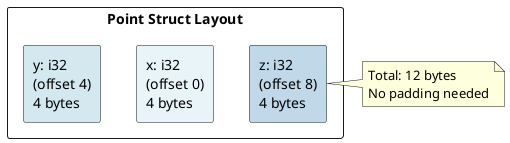
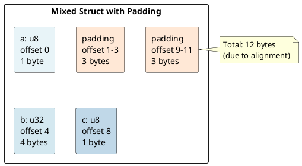
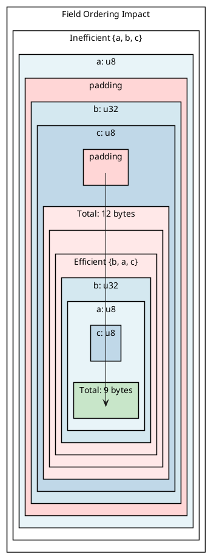
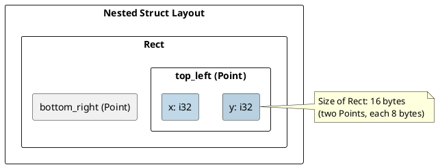

# Structs: Memory Layout Under the Hood

## Overview

Understanding struct memory layout is crucial for optimization, FFI, and debugging. The Rust compiler uses **field reordering** and **alignment** rules to minimize space.

---

## 1. Basic Struct Layout

### Struct Definition and Memory Allocation

```rust
struct Point {
    x: i32,     // 4 bytes
    y: i32,     // 4 bytes
    z: i32,     // 4 bytes
}
```

**Memory layout (simple, aligned):**



Each field stored sequentially, 12 bytes total.

---

## 2. Field Alignment and Padding

### The Alignment Problem

CPU access is most efficient when data aligns to its natural boundary:
- `u8` needs 1-byte alignment (any address)
- `u16` needs 2-byte alignment (even addresses)
- `u32` needs 4-byte alignment (multiples of 4)
- `u64` needs 8-byte alignment (multiples of 8)

### Example: Struct with Mixed Types

```rust
struct Mixed {
    a: u8,      // 1 byte, align 1
    b: u32,     // 4 bytes, align 4
    c: u8,      // 1 byte, align 1
}
```

**With padding (CORRECT):**



Compiler inserts **3 bytes padding** after `a` so `b` aligns to 4-byte boundary, and **3 bytes padding** after `c` for alignment.

---

## 3. Size and Alignment Queries

### std::mem::size_of and std::mem::align_of

```rust
let point = Point { x: 1, y: 2, z: 3 };
println!("Size: {}", std::mem::size_of_val(&point));      // 12
println!("Alignment: {}", std::mem::align_of_val(&point)); // 4

let mixed = Mixed { a: 1, b: 2, c: 3 };
println!("Size: {}", std::mem::size_of_val(&mixed));      // 12
println!("Alignment: {}", std::mem::align_of_val(&mixed)); // 4
```

### Calculating Struct Size

1. Align struct to largest field's alignment
2. Pad between fields for alignment
3. Pad after last field if needed

```
struct Mixed {
    a: u8,       // align 1, size 1
    b: u32,      // align 4, size 4
    c: u8,       // align 1, size 1
}

Struct alignment: max(1, 4, 1) = 4
Offset 0: a (1 byte)
Offset 1-3: padding (3 bytes to align b to 4)
Offset 4-7: b (4 bytes)
Offset 8: c (1 byte)
Offset 9-11: padding (3 bytes, struct size must be multiple of alignment)

Final size: 12 bytes (multiple of 4)
```

---

## 4. Struct Size Optimization

### Field Reordering for Smaller Structs

Declare fields in **descending order of alignment** to minimize padding:

```rust
// BAD (12 bytes with padding):
struct Inefficient {
    a: u8,       // 1 byte, align 1
    b: u32,      // 4 bytes, align 4 (needs padding before)
    c: u8,       // 1 byte, align 1 (needs padding after)
}

// GOOD (9 bytes, no padding):
struct Efficient {
    b: u32,      // 4 bytes, align 4
    a: u8,       // 1 byte, align 1
    c: u8,       // 1 byte, align 1
}
```

**Layout comparison:**



**Savings:** 3 bytes (25%) by reordering fields!

---

## 5. Zero-Sized Types (ZSTs)

### Types with Size 0

```rust
struct Marker;  // Zero-sized type (ZST)

println!("{}", std::mem::size_of::<Marker>());  // 0
```

**Common ZSTs:**
- `()` (unit type)
- `PhantomData<T>`
- Enums with only unit variants

**Use case:** ZSTs can be stored in collections with zero overhead:

```rust
struct Permissions;  // ZST marker for permissions

let perms: Vec<Permissions> = Vec::new();
println!("Size: {}", std::mem::size_of_val(&perms));  // 24
```

---

## 6. Struct Methods and Self

### Methods and Memory

Methods are **zero-cost abstractions** — they're syntactic sugar:

```rust
impl Point {
    fn x(&self) -> i32 { self.x }
    fn move_by(&mut self, dx: i32, dy: i32) {
        self.x += dx;
        self.y += dy;
    }
}

let mut p = Point { x: 1, y: 2, z: 3 };
p.move_by(10, 20);
```

Compilation translates to: `Point::move_by(&mut p, 10, 20);`

**Memory impact:** NONE. Methods are free abstractions.

---

## 7. Tuple Structs

### Struct Variants

```rust
// Named fields
struct Point { x: i32, y: i32 }

// Tuple struct (similar layout, less syntax)
struct Point2(i32, i32);

// Unit struct (zero-sized)
struct Marker;
```

**Layout:** Same as named structs. Access via `.0`, `.1`.

---

## 8. Repr Attributes

### #[repr(Rust)] (Default)

The compiler may reorder fields for optimization:

```rust
#[repr(Rust)]
struct Data { a: u8, b: u32, c: u8 }
// Layout: May NOT be in declaration order!
```

### #[repr(C)] (C Compatibility)

Guarantees layout matches C structs (no reordering):

```rust
#[repr(C)]
struct CData {
    a: u8,      // offset 0
    b: u32,     // offset 4 (with padding)
    c: u8,      // offset 8
}
```

**Use case:** FFI with C libraries.

### #[repr(transparent)]

Guaranteed to have same layout as single field:

```rust
#[repr(transparent)]
struct UserId(u64);
// Has identical layout to u64
```

---

## 9. Nested Structs

```rust
struct Point { x: i32, y: i32 }

struct Rect {
    top_left: Point,
    bottom_right: Point,
}
```

**Memory layout:**



Nested structs flatten into parent struct's layout — no additional overhead.

---

## 10. Structs with Generics

### Generic Struct Monomorphization

```rust
struct Pair<T> { first: T, second: T }

let pair_i32 = Pair { first: 1, second: 2 };
let pair_str = Pair { first: "a", second: "b" };
```

**Compilation:**
```
Pair<i32> → struct with two i32 fields
Pair<&str> → struct with two &str fields (pointer + length)
```

Each generic specialization gets **its own monomorphized type**.

---

## 11. Size Examples

```rust
struct A { x: u8, y: u8, z: u8 }
// Size: 3 bytes, align: 1

struct B {
    x: u8,
    _pad: [u8; 3],
    y: u32,
}
// Size: 8 bytes, align: 4

struct C { x: u64, y: u32, z: u8 }
// Size: 16 bytes (3 bytes padding), align: 8

struct D {
    x: Box<i32>,  // 8 (pointer)
    y: String,    // 24 (pointer + len + cap)
    z: u32,       // 4
}
// Size: 40 bytes (depends on alignment), align: 8
```

---

## 12. Performance: Cache Lines

Modern CPUs access memory in **cache lines** (typically 64 bytes):

```rust
// BAD: Fields scattered across cache lines
struct Inefficient { a: u64, b: u8, c: u64, d: u8 }

// GOOD: Related fields together
struct Efficient { a: u64, c: u64, b: u8, d: u8 }
```

---

## Summary Table

| Concept | Rule |
|---------|------|
| **Alignment** | Fields align to their natural boundary (1, 2, 4, 8 bytes) |
| **Padding** | Compiler inserts padding to maintain alignment |
| **Size** | Total size must be multiple of struct's alignment |
| **Field Order** | `#[repr(Rust)]` may reorder; `#[repr(C)]` respects order |
| **ZSTs** | Zero-sized types have size 0 |
| **Methods** | Zero-cost abstraction, don't affect memory layout |
| **Generics** | Monomorphized per type, each specialized separately |

---

**Next:** [[cs/rust/08-enums|Enums]] — Learn discriminants and tag representation
