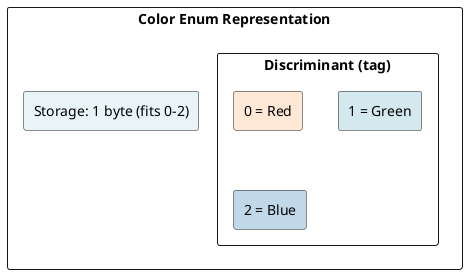
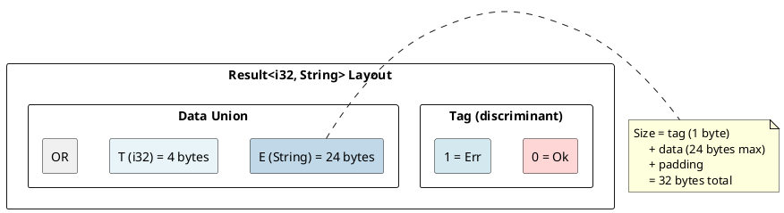
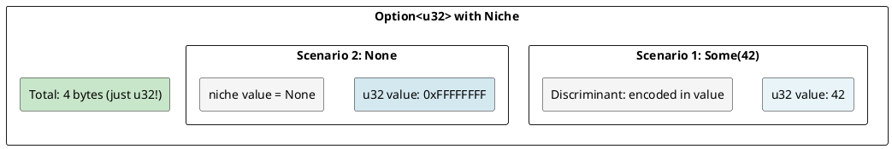
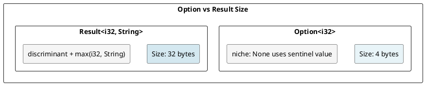
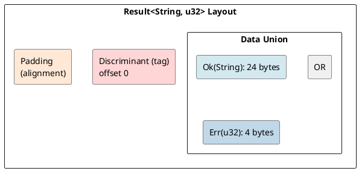

# Enums: Discriminant and Tag Representation Under the Hood

## Overview

Enums in Rust are **tagged unions** (also called discriminated unions). Each enum variant is tagged with a discriminant, allowing the compiler to track which variant is active and enforce safe pattern matching.

---

## 1. Enum Basics and Discriminants

### Simple Enum

```rust
enum Color { Red, Green, Blue }
```

**Representation:**
- Each variant gets a **discriminant** (an integer tag)
- `Red = 0`, `Green = 1`, `Blue = 2` (assigned automatically)



### Explicit Discriminants

```rust
enum Status { Pending = 0, Running = 1, Complete = 2 }
```

---

## 2. Enums with Data

### Variants with Payloads

```rust
enum Result<T, E> { Ok(T), Err(E) }
```

**Memory layout:**



### Size Calculation

```rust
enum Result<i32, String> { Ok(i32), Err(String) }

// Compiler allocates:
// - Discriminant: 1 byte (for 2 variants)
// - Padding: 7 bytes (alignment)
// - Data: 24 bytes (largest variant)
// Total: 32 bytes
```

---

## 3. The Discriminant

### Automatic Discriminants (C-like)

```rust
enum Direction { North, South, East, West }
println!("{}", Direction::North as u8);  // 0
```

### Explicit Discriminants

```rust
enum HttpStatus { Ok = 200, NotFound = 404, ServerError = 500 }
```

### #[repr] for Discriminant Type

```rust
#[repr(u8)]
enum Small { A, B, C }  // Uses u8 (1 byte)

#[repr(u32)]
enum Large { X, Y, Z }  // Uses u32 (4 bytes)

println!("{}", std::mem::size_of::<Small>());  // 1
println!("{}", std::mem::size_of::<Large>());  // 4
```

---

## 4. Tagless Enums (Niche Optimization)

### Rust's Niche Optimization

Rust is smart about reducing enum size when possible:

```rust
enum Option<T> { Some(T), None }

// Option<u32>: 8 bytes (not 5 or 9!)
println!("{}", std::mem::size_of::<Option<u32>>());  // 8

// WHY? u32 uses values 0..=4294967295
// Rust reserves one "niche" value (e.g., 0xFFFFFFFF) to represent None
// No separate discriminant needed!
```

**Memory layout:**



### Example: Option Sizes

```rust
println!("{}", std::mem::size_of::<Option<u8>>());     // 1
println!("{}", std::mem::size_of::<Option<i32>>());    // 4
println!("{}", std::mem::size_of::<Option<bool>>());   // 1
println!("{}", std::mem::size_of::<Option<String>>()); // 24
```

---

## 5. Pattern Matching Compilation

### How Pattern Matching Works

```rust
match result {
    Ok(value) => println!("Value: {}", value),
    Err(e) => println!("Error: {}", e),
}
```

**Compilation (conceptual):**
```rust
match result {
    Ok(value) => {
        // Check discriminant == 0
        let value = result.data;
        println!("Value: {}", value);
    },
    Err(e) => {
        // Check discriminant == 1
        let e = result.data;
        println!("Error: {}", e);
    },
}
```

### Exhaustiveness Checking

The compiler ensures all variants are handled:

```rust
match result {
    Ok(_) => {},
    // ERROR: missing Err variant
}

match result {
    Ok(_) => {},
    Err(_) => {},
    // OK: all variants handled
}
```

---

## 6. Common Enums

### `Option<T>`

```rust
enum Option<T> { Some(T), None }

let x: Option<i32> = Some(42);  // 4 bytes
let y: Option<i32> = None;      // 4 bytes
```

### `Result<T, E>`

```rust
enum Result<T, E> { Ok(T), Err(E) }

let success: Result<i32, String> = Ok(42);
let error: Result<i32, String> = Err("failed".to_string());
```

**Memory:**



---

## 7. Enum Size Reference

```
enum Type                    Size (typical)    Notes
────────────────────         ──────────────    ─────────────
Void (no variants)           0                 Uninhabited type
Unit (no data)               1                 Just discriminant
Option<()>                   1                 Niche optimization
Option<bool>                 1                 Fits in one byte
Option<u32>                  4                 Niche optimization
Option<String>               24 or 32          Niche may not work
Result<u32, u32>             8                 Discriminant + 4 bytes
Result<String, String>       48-56             Two 24-byte variants
```

---

## 8. Discriminant Memory Location

### Where is the Discriminant Stored?

Typically **at the beginning** of the enum:



Sometimes Rust **folds** the discriminant into unused bits of data (niche optimization).

---

## Key Takeaways

| Concept | Details |
|---------|---------|
| **Discriminant** | Tag integer identifying which variant is active |
| **Size** | max(variant_sizes) + tag overhead |
| **Niche Optimization** | Reuse unused values as variant markers (free tag!) |
| **Pattern Matching** | Exhaustiveness checking at compile-time |
| **`Option<T>`** | Usually same size as T (niche) |
| **`Result<T,E>`** | max(T, E) + tag overhead |

---

**Next:** [[cs/rust/09-generics|Generics & Monomorphization]] — Learn monomorphization and type specialization
