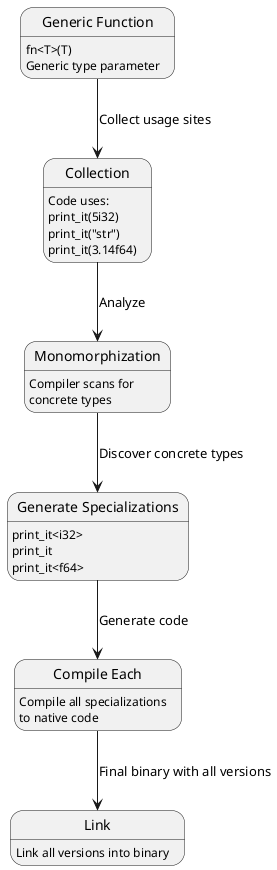
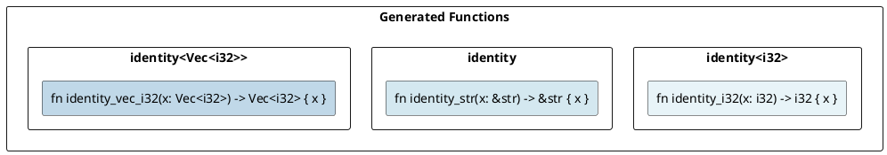
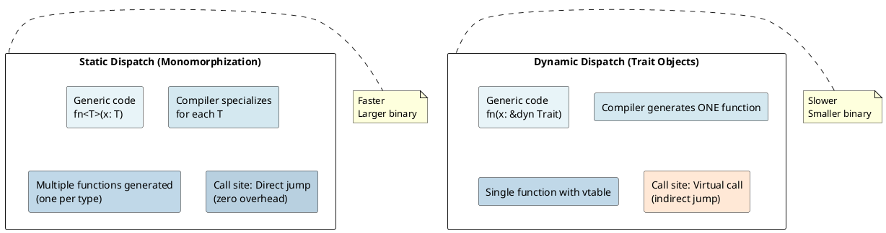
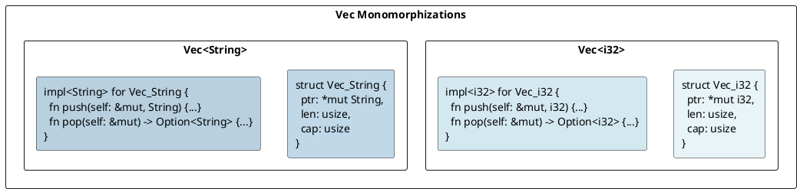

# Generics & Monomorphization: Under the Hood

## Overview

**Monomorphization** is the process where Rust's compiler generates **specialized versions** of generic code for each concrete type. This enables zero-cost abstractions while maintaining type safety.

---

## 1. What is Monomorphization?

### Generic Code to Specialized Code

```rust
fn print_it<T: std::fmt::Debug>(val: T) {
    println!("{:?}", val);
}

print_it(5i32);
print_it("hello");
print_it(3.14f64);
```

**At compile time, Rust generates:**

```rust
fn print_it_i32(val: i32) { println!("{:?}", val); }
fn print_it_str(val: &str) { println!("{:?}", val); }
fn print_it_f64(val: f64) { println!("{:?}", val); }
```

**Result:** No runtime overhead — each call is **direct**, not through dynamic dispatch.

---

## 2. The Monomorphization Process



---

## 3. Generic Functions

```rust
fn identity<T>(x: T) -> T { x }

let a = identity(42);           // i32
let b = identity("hello");      // &str
let c = identity(vec![1, 2]);   // Vec<i32>
```

**Monomorphized:**



---

## 4. Generic Structs

```rust
struct Pair<T> { first: T, second: T }

let pair_i32 = Pair { first: 1, second: 2 };
let pair_str = Pair { first: "a", second: "b" };
```

**Compiler generates separate types for each concrete instantiation:**

- `Pair<i32>`: 8 bytes
- `Pair<&str>`: 16 bytes (2 pointers + 2 lengths)
- `Pair<String>`: 48 bytes (2 Strings, each 24 bytes)

---

## 5. Generic Methods

```rust
impl<T> Pair<T> {
    fn new(first: T, second: T) -> Self { Pair { first, second } }
    fn first(&self) -> &T { &self.first }
}
```

Each monomorphized type gets **its own method implementations**.

---

## 6. Trait Bounds and Monomorphization

### Static Dispatch (Monomorphized)

```rust
fn print_it<T: std::fmt::Debug>(x: T) {
    println!("{:?}", x);
}

print_it(5);        // Generate: print_it<i32>
print_it("hello");  // Generate: print_it<&str>
```

Two functions generated, each specialized.

### Dynamic Dispatch (Not Monomorphized)

```rust
fn print_it(x: &dyn std::fmt::Debug) {
    println!("{:?}", x);
}

print_it(&5);        // No specialization — virtual call
print_it(&"hello");  // No specialization — virtual call
```

One function generated, uses virtual function calls.

→ See [[cs/rust/15-trait-objects|Trait Objects]] for details.

---

## 7. Generic Instantiation Sites

### Code Bloat: Monomorphization Explosion

```rust
fn generic_swap<T>(a: &mut T, b: &mut T) {
    std::mem::swap(a, b);
}

// Used with many types → many specialized versions
generic_swap(&mut x_i32, &mut y_i32);
generic_swap(&mut x_String, &mut y_String);
generic_swap(&mut x_Vec, &mut y_Vec);
```

**Trade-off:**
- ✅ **Benefit:** Zero runtime overhead, specialization optimizations
- ❌ **Cost:** Larger binary size ("code bloat")

### Mitigation Strategies

```rust
// Strategy 1: Move generic logic to non-generic function
fn swap_generic<T>(a: &mut T, b: &mut T) {
    unsafe { std::ptr::swap(a, b); }
}

// Strategy 2: Share code via references (dynamic dispatch)
fn swap_dyn(a: &mut dyn Any, b: &mut dyn Any) {
    // Slower, but single implementation
}
```

---

## 8. Monomorphization vs Dynamic Dispatch



---

## 9. Const Generics

### Const Type Parameters

```rust
struct Array<T, const N: usize> {
    data: [T; N],
}

let arr1: Array<i32, 5> = Array { data: [0; 5] };
let arr2: Array<i32, 10> = Array { data: [0; 10] };
```

Each const value generates **new specialization**.

---

## 10. Compilation Time Impact

### Monomorphization Increases Compile Time

```
Compile time = parsing + analysis + monomorphization + codegen + linking
More generic usage = More monomorphizations = Longer compile time
```

---

## 11. Example: `Vec<T>` Monomorphization

```rust
let v1: Vec<i32> = vec![1, 2, 3];
let v2: Vec<String> = vec!["a".to_string()];
```



---

## Key Takeaways

| Aspect | Details |
|--------|---------|
| **Monomorphization** | Compile-time specialization for each concrete type |
| **Static Dispatch** | Direct function calls, zero runtime overhead |
| **Binary Size** | Increases with more monomorphizations |
| **Compile Time** | Increases with more monomorphizations |
| **Optimization** | Each specialization can be optimized independently |
| **vs Dynamic Dispatch** | Faster (static) vs smaller binaries (dynamic) |

---

**Next:** [[cs/rust/10-traits|Trait System]] — Learn virtual tables and dynamic dispatch
