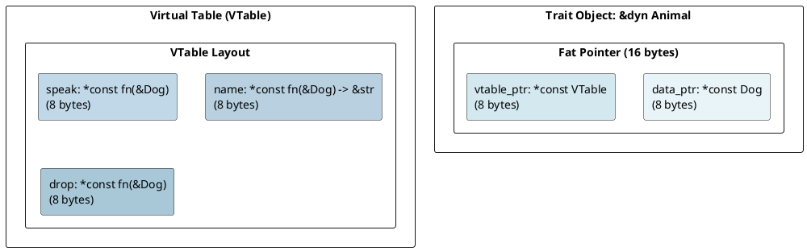
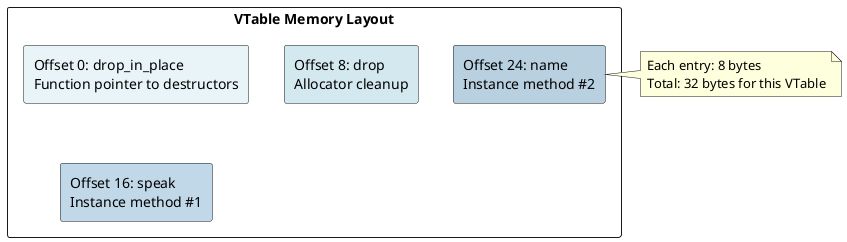
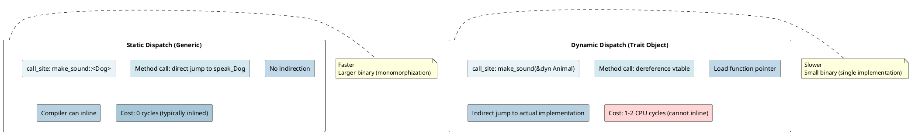

# Trait System: Virtual Tables and Dispatch Under the Hood

## Overview

Traits are Rust's answer to polymorphism. Understanding **static vs dynamic dispatch** and **virtual tables** is key to knowing when Rust code is zero-cost and when there's overhead.

---

## 1. What is a Trait?

### Trait Definition

```rust
trait Animal {
    fn speak(&self);
    fn name(&self) -> &str;
}

struct Dog { name: String }

impl Animal for Dog {
    fn speak(&self) { println!("Woof!"); }
    fn name(&self) -> &str { &self.name }
}
```

**Compiler perspective:**
- Trait is a **contract** specifying methods
- Impl block provides concrete implementation for type

---

## 2. Static Dispatch (Monomorphization)

### Generic Trait Bounds

```rust
fn make_sound<A: Animal>(animal: A) {
    animal.speak();
}

let dog = Dog { name: "Rex".to_string() };
make_sound(dog);  // Monomorphizes: make_sound::<Dog>
```

**Compilation:**
```rust
// Compiler generates:
fn make_sound_Dog(animal: Dog) {
    Animal::speak(&animal);  // Direct call
}
```

**Result:** Direct method call, **zero runtime overhead**.

---

## 3. Dynamic Dispatch (Trait Objects)

### Trait Objects (dyn Trait)

```rust
fn make_sound(animal: &dyn Animal) {
    animal.speak();
}

let dog = Dog { name: "Rex".to_string() };
make_sound(&dog);  // No monomorphization!
```

**Representation:** A **fat pointer** containing:
1. **Data pointer** - points to actual object
2. **Virtual table pointer** - points to vtable



### Method Call Through VTable

```
1. Extract vtable_ptr from fat pointer
2. Look up speak method in vtable
3. Load function pointer
4. Call function: speak(data_ptr)
```

**Result:** Indirect method call with **vtable lookup overhead** (~1-2 CPU cycles).

---

## 4. VTable Structure

### Typical VTable Layout

```rust
struct VTableForDogAsAnimal {
    drop_in_place: fn(*mut Dog),
    drop: fn(&Dog),
    speak: fn(&Dog),
    name: fn(&Dog) -> &str,
}
```



---

## 5. Static vs Dynamic Dispatch Comparison

### Performance Trade-off



---

## 6. When to Use Each

### Static Dispatch (`fn<T: Trait>`)

**Use when:** Performance is critical, type is known at compile-time.

```rust
fn process<T: Debug>(item: T) { println!("{:?}", item); }
process(42);        // Specialized version generated
process("hello");   // Different specialized version
```

### Dynamic Dispatch (&dyn Trait)

**Use when:** You need runtime polymorphism, type is unknown at compile-time.

```rust
fn process(item: &dyn Debug) { println!("{:?}", item); }

let items: Vec<&dyn Debug> = vec![&42, &"hello"];  // Mixed types!
for item in items { process(item); }
```

---

## 7. Object Safety

### What is Object-Safe?

A trait is **object-safe** if it can be used as a trait object (`&dyn Trait`).

```rust
// Object-safe trait ✓
trait Drawable { fn draw(&self); }

// NOT object-safe ✗
trait Sized { fn size_of_self() -> usize; }

trait GenericTrait<T> { fn process(&self, item: T); }
```

**Why?** At runtime, the actual type is erased. The vtable cannot work with:
- Methods taking `Self` by value (size unknown)
- Generic type parameters (too specific)
- Class methods with no receiver

---

## 8. Associated Types

### Traits with Associated Types

```rust
trait Container {
    type Item;  // Associated type (filled in by impl)
    fn contains(&self, item: Self::Item) -> bool;
}

impl Container for Vec<String> {
    type Item = String;
    fn contains(&self, item: String) -> bool {
        self.iter().any(|s| s == &item)
    }
}
```

---

## 9. Multiple Trait Bounds

### Combining Traits

```rust
fn process<T: Display + Debug + Clone>(item: T) {
    println!("{:?}", item);
    println!("{}", item);
    let copy = item.clone();
}
```

---

## Summary Table

| Feature | Static | Dynamic |
|---------|--------|---------|
| **Declaration** | `fn<T: Trait>` | `fn(&dyn Trait)` |
| **Binary Size** | Large (monomorphized) | Small (single impl) |
| **Performance** | Fast (direct call) | Slower (vtable) |
| **Inlining** | Yes | No |
| **Type Erasure** | No | Yes |
| **Fat Pointer** | No | Yes (16 bytes) |

---

**Next:** [[cs/rust/11-smart-pointers|Smart Pointers]] — Learn Box, Rc, Arc, and Weak
