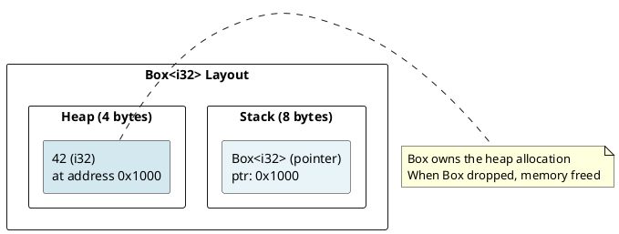
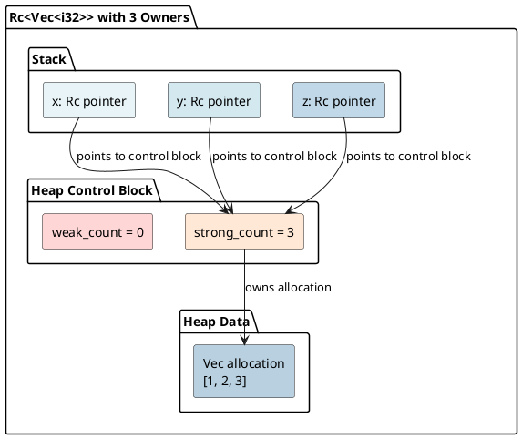
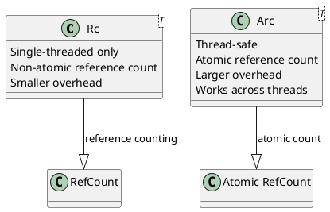

# Smart Pointers: Box, Rc, Arc, Weak Under the Hood

## Overview

Smart pointers are abstractions that own and manage heap memory. Each provides different semantics: exclusive ownership (Box), reference counting (Rc/Arc), and weak references (Weak).

---

## 1. Box: Exclusive Heap Allocation

### What is Box?

Box is the simplest smart pointer: **allocates on heap, one owner**.

```rust
let b = Box::new(42);  // Allocate i32 on heap
println!("{}", b);     // Dereference implicitly
```

### Box Memory Layout



### Box Size

```rust
println!("{}", std::mem::size_of::<Box<i32>>());      // 8 (just pointer)
println!("{}", std::mem::size_of::<Box<String>>());   // 8 (just pointer)
```

Box itself is tiny (8 bytes on 64-bit). The data is on the heap.

---

## 2. Rc: Reference Counting (Single-Threaded)

### Shared Ownership

```rust
use std::rc::Rc;

let x = Rc::new(vec![1, 2, 3]);  // Create rc'd vector
let y = Rc::clone(&x);            // Increment reference count
let z = Rc::clone(&x);            // Increment again
```

### Reference Count Mechanism



### Rc Drop Behavior

```rust
{
    let x = Rc::new(42);  // count = 1
    {
        let y = Rc::clone(&x);  // count = 2
    }  // y dropped: count = 2 → 1
}  // x dropped: count = 1 → 0 → Memory freed!
```

---

## 3. Arc: Atomic Reference Counting (Thread-Safe)

### Shared Ownership Across Threads

```rust
use std::sync::Arc;
use std::thread;

let data = Arc::new(vec![1, 2, 3]);

for i in 0..3 {
    let data_clone = Arc::clone(&data);
    thread::spawn(move || {
        println!("{:?}", data_clone);
    });
}
```

### Arc vs Rc



### Arc Implementation Detail

```rust
pub struct Arc<T> {
    ptr: *const ArcInner<T>,
}

struct ArcInner<T> {
    strong: AtomicUsize,    // Atomic for thread-safety
    weak: AtomicUsize,
    data: T,
}
```

The reference count uses **AtomicUsize** for thread-safe increment/decrement.

---

## 4. Weak: Non-Owning References

### Preventing Circular References

```rust
use std::rc::{Rc, Weak};
use std::cell::RefCell;

struct Node {
    value: i32,
    next: Option<Rc<Node>>,
    prev: Option<Weak<Node>>,  // Weak to prevent cycle
}
```

### Weak Reference Count

```
struct ArcInner<T> {
    strong: AtomicUsize,  // Rc/Arc references
    weak: AtomicUsize,    // Weak references
    data: T,
}

// Data freed when: strong_count == 0
// Control block freed when: strong_count == 0 AND weak_count == 0
```

### Using Weak

```rust
let rc = Rc::new(42);
let weak = Rc::downgrade(&rc);  // Create weak ref

if let Some(strong) = weak.upgrade() {
    println!("{}", strong);  // Can use it
} else {
    println!("Value was dropped");
}
```

---

## 5. Interior Mutability with RefCell

### Combining Rc and RefCell

```rust
use std::rc::Rc;
use std::cell::RefCell;

let data = Rc::new(RefCell::new(vec![1, 2, 3]));
let clone1 = Rc::clone(&data);
let clone2 = Rc::clone(&data);

clone1.borrow_mut().push(4);
clone2.borrow_mut().push(5);

println!("{:?}", data.borrow());  // [1, 2, 3, 4, 5]
```

---

## 6. Smart Pointer Sizes

```rust
println!("{}", std::mem::size_of::<Box<i32>>());     // 8
println!("{}", std::mem::size_of::<Rc<i32>>());      // 8
println!("{}", std::mem::size_of::<Arc<i32>>());     // 8
println!("{}", std::mem::size_of::<Weak<i32>>());    // 8
```

All smart pointers are **8 bytes on 64-bit systems**.

---

## 7. Deref and Deref Coercion

```rust
impl<T> Deref for Box<T> {
    type Target = T;
    fn deref(&self) -> &T { &**self }
}

let b = Box::new(42);
println!("{}", *b);      // Explicit deref
println!("{}", b.field); // Deref coercion (automatic)
```

---

## 8. Key Takeaways

| Pointer | Ownership | Thread-Safe | Overhead | Use Case |
|---------|-----------|------------|----------|----------|
| **Box** | Exclusive | N/A | 8 bytes | Heap allocation, dynamic sizing |
| **Rc** | Shared (single-thread) | No | 16+ bytes | Reference counting (single-thread) |
| **Arc** | Shared (multi-thread) | Yes | 24+ bytes | Reference counting (multi-thread) |
| **Weak** | Non-owning | Via Arc | 8 bytes | Break circular refs |

---

**Next:** [[cs/rust/12-interior-mutability|Interior Mutability]] — Cell, RefCell, Mutex explained
