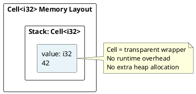
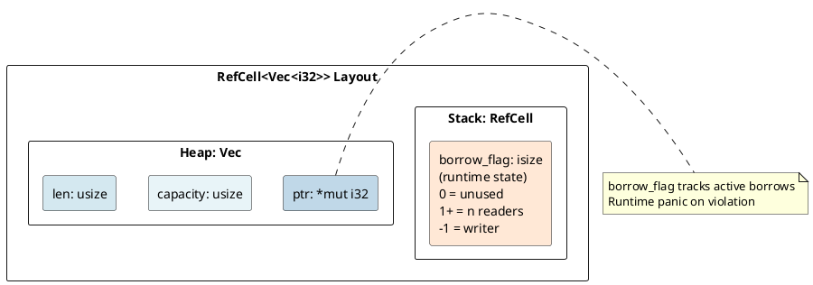
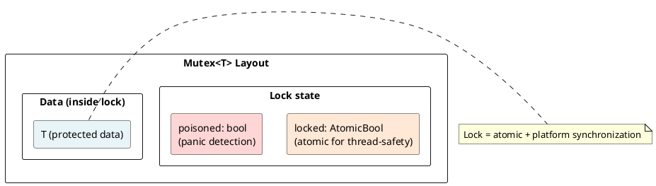

# Interior Mutability: Cell, RefCell, Mutex Under the Hood

## Overview

**Interior mutability** is a pattern to allow mutation through immutable references. Rust's borrow checker operates at compile-time; interior mutability shifts some checks to runtime. Three main implementations: `Cell<T>` (for Copy types), `RefCell<T>` (single-threaded), and `Mutex<T>` (thread-safe).

---

## 1. The Core Problem

### Compile-Time Limitation

```rust
struct Person {
    name: String,
    age: u32,
}

impl Person {
    fn have_birthday(&self) {
        self.age += 1;  // ERROR: cannot assign through immutable reference
    }
}
```

### Interior Mutability Solution

```rust
struct Person {
    name: String,
    age: Cell<u32>,
}

impl Person {
    fn have_birthday(&self) {
        self.age.set(self.age.get() + 1);
    }
}
```

---

## 2. Cell: Static Checking via Copy

### How Cell Works

```rust
use std::cell::Cell;

let x = Cell::new(42);
x.set(100);
let val = x.get();  // 100 (Copy trait required!)
```

### Cell Layout



### Cell Restriction

```rust
println!("{}", std::mem::size_of::<Cell<i32>>());    // 4 (same as i32)
```

Only `Copy` types (primitives, small copyable structs).

---

## 3. RefCell: Runtime Checking

### RefCell Usage

```rust
use std::cell::RefCell;

let x = RefCell::new(vec![1, 2, 3]);

let borrow = x.borrow();
println!("{:?}", *borrow);
drop(borrow);

let mut borrow_mut = x.borrow_mut();
borrow_mut.push(4);
drop(borrow_mut);

let borrow2 = x.borrow();
println!("{:?}", *borrow2);  // [1, 2, 3, 4]
```

### RefCell Memory Layout



### Borrow Flag Encoding

```rust
type BorrowFlag = isize;
const UNUSED: isize = 0;    // No borrows
const WRITING: isize = -1;  // Currently being mutably borrowed
const READING: isize = 1;   // Reading (n readers = n)
```

---

## 4. Runtime Panic on Borrow Violation

```rust
let x = RefCell::new(42);

let borrow1 = x.borrow();      // borrow_flag = 1
let borrow2 = x.borrow();      // borrow_flag = 2 (OK)

// PANIC! Tried to mutably borrow while already borrowed
// let borrow_mut = x.borrow_mut();
```

---

## 5. `Rc<RefCell<T>>`: Shared Mutable State

```rust
use std::rc::Rc;
use std::cell::RefCell;

let data = Rc::new(RefCell::new(vec![1, 2, 3]));

let clone1 = Rc::clone(&data);
let clone2 = Rc::clone(&data);

clone1.borrow_mut().push(4);
clone2.borrow_mut().push(5);

println!("{:?}", data.borrow());  // [1, 2, 3, 4, 5]
```

---

## 6. Mutex: Thread-Safe Interior Mutability

### Thread-Safe Variant

```rust
use std::sync::Mutex;

let data = Mutex::new(0);

thread::scope(|s| {
    s.spawn(|| { let mut guard = data.lock().unwrap(); *guard += 1; });
    s.spawn(|| { let mut guard = data.lock().unwrap(); *guard += 1; });
});

println!("{}", *data.lock().unwrap());  // 2
```

### Mutex Architecture



---

## 7. Differences: Cell vs RefCell vs Mutex

| Type | Overhead | Thread-Safe | Panic Risk | Use Case |
|------|----------|-------------|-----------|----------|
| **Cell** | None | No | No | Copyable caches |
| **RefCell** | Low | No | Yes | Shared mutable state (single-thread) |
| **Mutex** | High | Yes | No | Shared mutable state (multi-thread) |

---

## 8. Performance Comparison

```
Operation            | Cell  | RefCell | Mutex
get/set (Copy)      | 1 ns  | 50 ns   | 100+ ns
borrow checking     | None  | 5 ns    | 100+ ns
Memory footprint    | Same  | +4 bytes| +16+ bytes
```

---

## 9. Real-World Example: Logger

```rust
use std::cell::RefCell;

struct Logger {
    messages: RefCell<Vec<String>>,
}

impl Logger {
    fn log(&self, msg: String) {
        self.messages.borrow_mut().push(msg);
    }
}
```

---

## Key Takeaways

| Type | Overhead | Thread-Safe | Panic Risk | Use Case |
|------|----------|-------------|-----------|----------|
| **Cell** | None | No | No | Copyable caches |
| **RefCell** | Low | No | Yes | Shared mutable state (single-thread) |
| **Mutex** | High | Yes | No | Shared mutable state (multi-thread) |

---

**Next:** [[cs/rust/13-error-handling|Error Handling]] — Learn panic semantics and Result propagation
