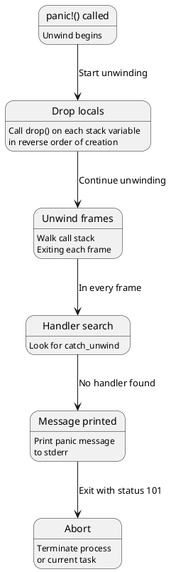

# Error Handling: Panic Semantics and Result Propagation

## Overview

Rust provides two error handling mechanisms: **panic** (unrecoverable, terminates task/thread) and **`Result<T,E>`** (recoverable, explicit handling).

---

## 1. Panics: Unwind Mechanism

### What is a Panic?

```rust
panic!("Something went wrong!");

fn divide(a: i32, b: i32) -> i32 {
    if b == 0 { panic!("Division by zero!"); }
    a / b
}
```

### Panic Execution Flow



---

## 2. `Result<T, E>` Representation

### Result Enum

```rust
pub enum Result<T, E> {
    Ok(T),
    Err(E),
}
```

### Result Size

```rust
println!("{}", std::mem::size_of::<Result<i32, String>>());  // 32
println!("{}", std::mem::size_of::<Result<(), String>>());   // 24
println!("{}", std::mem::size_of::<Result<i32, ()>>());       // 8 (niche)
```

---

## 3. The ? Operator

### Short-Circuit Error Propagation

```rust
fn parse_config(s: &str) -> Result<Config, Error> {
    let a = parse_a(s)?;      // If Err, return immediately
    let b = parse_b(s)?;
    let c = parse_c(s)?;
    Ok(Config { a, b, c })
}
```

### ? Desugaring

```rust
// This:
let x = some_result?;

// Desugars to:
let x = match some_result {
    Ok(val) => val,
    Err(err) => return Err(err.into()),
};
```

---

## 4. Panic Modes: Unwind vs Abort

### Unwind (Default)

```rust
// Cargo.toml
[profile.release]
panic = "unwind"  // Stack unwinding + drop cleanup
```

### Abort

```rust
// Cargo.toml
[profile.release]
panic = "abort"  // Immediate termination, no cleanup
```

---

## 5. Catching Panics

```rust
use std::panic;

let result = panic::catch_unwind(|| {
    let x = 42 / 0;  // Would panic
});

match result {
    Ok(val) => println!("Success: {}", val),
    Err(_) => println!("Caught panic!"),
}
```

---

## 6. Error Types and From/Into

```rust
impl From<std::io::Error> for MyError {
    fn from(e: std::io::Error) -> Self {
        MyError::Io(e)
    }
}

// ? operator uses this:
let file = std::fs::File::open("test.txt")?;  // IoError auto-converted
```

---

## 7. Panic in Threads

```rust
let handle = thread::spawn(|| {
    panic!("error in thread");
});

match handle.join() {
    Ok(_) => println!("Thread succeeded"),
    Err(_) => println!("Thread panicked"),
}
// Main thread continues unaffected
```

---

## 8. Result Combinators

```rust
let result: Result<i32, &str> = Ok(10);

result.map(|x| x * 2);                 // Ok(20)
result.and_then(|x| Ok(x * 2));        // Ok(20)
result.unwrap_or(0);                    // 10
result.unwrap_or_else(|_| 0);          // 10
```

---

## Summary

| Aspect | Panic | Result |
|--------|-------|--------|
| **Recovery** | No (terminates) | Yes (explicit) |
| **Type** | Unwind token | Enum (Ok/Err) |
| **Overhead** | Unwind cost | None (zero-cost) |
| **When** | Invariants violated | Expected failures |
| **Propagation** | Stack unwind | ? operator |

---

**Next:** [[cs/rust/14-pattern-matching|Pattern Matching]] — Learn match compilation and exhaustiveness
