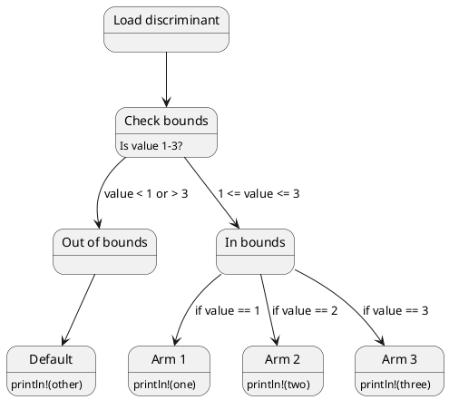
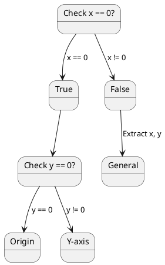
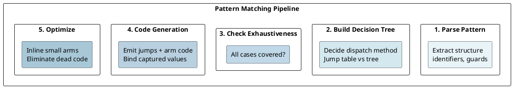

# Pattern Matching: Compilation to Jump Tables and Exhaustiveness

## Overview

Pattern matching is a first-class feature in Rust. The compiler transforms `match` expressions into efficient **jump tables** or **decision trees**, ensuring **exhaustiveness** at compile-time.

---

## 1. Match Expression Compilation

### Simple Match

```rust
let x = 2;
match x {
    1 => println!("one"),
    2 => println!("two"),
    3 => println!("three"),
    _ => println!("other"),
}
```

### Compilation Strategy

The compiler chooses between:
1. **Jump table** — O(1) dispatch (for small integer ranges)
2. **Decision tree** — O(log n) comparisons (for sparse ranges)
3. **Direct comparison** — O(n) comparisons (for small match arms)

### Jump Table



---

## 2. Enum Pattern Matching

### Discriminant-based Dispatch

```rust
match result {
    Ok(val) => process(val),
    Err(e) => handle_error(e),
}
```

Discriminants stored inline in the enum data. Compiler reads discriminant and jumps to corresponding arm.

---

## 3. Struct Destructuring

```rust
match point {
    Point { x: 0, y: 0 } => println!("origin"),
    Point { x: 0, y } => println!("y-axis: {}", y),
    Point { x, y } => println!("({}, {})", x, y),
}
```

### Decision Tree



---

## 4. Guard Clauses

```rust
match x {
    n if n % 2 == 0 => println!("even"),
    n if n > 10 => println!("odd and > 10"),
    _ => println!("other"),
}
```

Compilation: jump to discriminant arm → evaluate guard → execute arm or fall through.

---

## 5. Exhaustiveness Checking

```rust
match x {
    Some(n) => println!("{}", n),
    // ERROR: missing None case
}

match x {
    Some(n) => println!("{}", n),
    None => println!("no value"),
}
// OK: all variants covered
```

### Compiler's Algorithm

```
1. Build set of all possible values (type)
2. Subtract covered patterns (union of all arms)
3. If remainder non-empty → ERROR: non-exhaustive
4. If remainder empty → OK: exhaustive
```

---

## 6. Performance: Match vs If-Else

```
Jump table dispatch: 1-2 CPU cycles
Decision tree dispatch: 2-5 CPU cycles
If-else chain: 1-10 CPU cycles (branch mispredictions)
```

---

## 7. Binding and Move Semantics

```rust
match result {
    Ok(value) => println!("{}", value),  // value moved from Ok
    Err(e) => println!("error: {}", e),
}

// Reference to avoid moving:
match &result {
    Ok(value) => println!("{}", value),  // value is &T
    Err(e) => println!("error: {}", e),
}
```

---

## Pattern Matching Pipeline



---

**Next:** [[cs/rust/15-trait-objects|Trait Objects]] — Learn polymorphism, fat pointers, and casting
