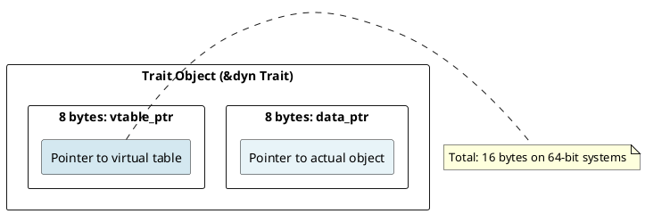
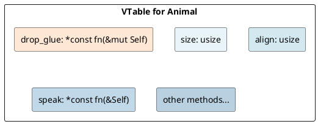
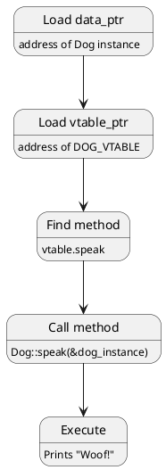

# Trait Objects: Fat Pointers, Polymorphism, and Dynamic Dispatch

## Overview

Trait objects enable **runtime polymorphism** through dynamic dispatch. Implemented as **fat pointers** (data pointer + virtual table pointer), they allow calling methods on unknown concrete types.

---

## 1. Static vs Dynamic Dispatch

### Static Dispatch (Generics)

```rust
fn process<T: Drawable>(item: T) {
    item.draw();  // Resolved at compile time
}
process(circle);  // Separate function for Circle::draw
process(square);  // Separate function for Square::draw
```

### Dynamic Dispatch (Trait Objects)

```rust
fn process(item: &dyn Drawable) {
    item.draw();  // Resolved at runtime via vtable
}
process(&circle);  // Same function, looks up method in vtable
process(&square);
```

---

## 2. Trait Object Creation

```rust
let animals: Vec<Box<dyn Animal>> = vec![
    Box::new(Dog),
    Box::new(Cat),
];

for animal in animals {
    animal.speak();  // Dispatches to correct implementation
}
```

---

## 3. Fat Pointer Structure



```rust
println!("{}", std::mem::size_of::<Box<dyn Animal>>());  // 16
println!("{}", std::mem::size_of::<&dyn Animal>());      // 16
println!("{}", std::mem::size_of::<Box<Dog>>());         // 8
```

---

## 4. Virtual Table (vtable)



### VTable Creation (Compile-Time)

```rust
// For Dog implementing Animal:
const DOG_VTABLE: &VTable = &VTable {
    drop_glue: <Dog as Drop>::drop,
    size: std::mem::size_of::<Dog>(),
    align: std::mem::align_of::<Dog>(),
    speak: <Dog as Animal>::speak,
};
```

---

## 5. Method Dispatch

```rust
let animal: &dyn Animal = &dog;
animal.speak();
```

### Dispatch Sequence



---

## 6. Object Safety

```rust
// Object-safe trait: ✓
trait Animal { fn speak(&self); }

// NOT object-safe: ✗ (returns Self)
trait Cloneable { fn clone(&self) -> Self; }

// NOT object-safe: ✗ (takes Self)
trait Movable { fn move_it(self); }
```

**Why?** Trait object requires all methods can work on `&dyn Trait` — but `Self` by value has unknown size at runtime.

---

## 7. Upcasting and Downcasting

### Upcasting (Safe)

```rust
let animal: &dyn Animal = &dog;
```

### Downcasting (via Any)

```rust
use std::any::Any;

let animal: &dyn Any = &dog;
if let Some(dog) = animal.downcast_ref::<Dog>() {
    println!("It's a dog!");
}
```

---

## 8. Performance Cost

```
Static dispatch (inline): call Dog::speak
Dynamic dispatch (vtable): mov rax, [vtable]; mov rcx, [rax + 24]; call rcx

Static: 1 ns
Dynamic: 3-5 ns (3-5× overhead for small methods)
```

---

## Summary

| Aspect | Trait Object | Generic |
|--------|-------------|---------|
| **Dispatch** | Dynamic (runtime) | Static (compile-time) |
| **Fat Pointer** | 16 bytes (ptr + vtable) | N/A |
| **Type Erasure** | Yes | No |
| **Code Size** | Smaller | Larger (monomorphization) |
| **Speed** | Slightly slower | Faster (inlining) |

---

**Next:** [[cs/rust/16-async-await|Async/Await]] — Learn state machines and futures
