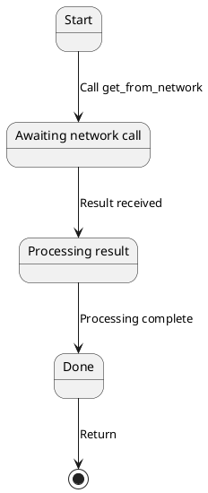
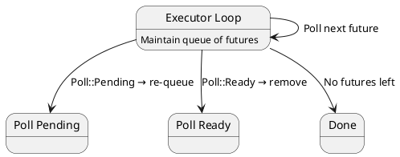
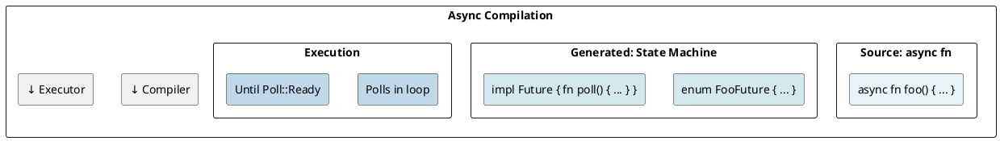

# Async/Await & Futures: State Machines Under the Hood

## Overview

`async/await` is syntactic sugar for **state machines**. The compiler transforms async functions into types implementing the `Future` trait. This transformation enables zero-cost async with high concurrency.

---

## 1. Futures: The Foundation

```rust
pub trait Future {
    type Output;
    fn poll(mut self: Pin<&mut Self>, cx: &mut Context<'_>) -> Poll<Self::Output>;
}

pub enum Poll<T> {
    Ready(T),
    Pending,
}
```

- **poll()** — tries to make progress toward completion
- **Poll::Ready(T)** — computation completed
- **Poll::Pending** — not ready yet, call again later

---

## 2. Async Functions as State Machines

```rust
async fn fetch_data() -> String {
    let data = get_from_network().await;
    process(data).await
}
```

### Compiler Transformation



**Generated state machine (conceptual):**

```rust
enum FetchDataFuture {
    Start,
    AwaitingNetwork { future: GetFromNetworkFuture },
    Processing { data: String, future: ProcessFuture },
    Done,
}

impl Future for FetchDataFuture {
    fn poll(mut self: Pin<&mut Self>, cx: &mut Context) -> Poll<String> {
        match self {
            FetchDataFuture::Start => {
                *self = FetchDataFuture::AwaitingNetwork { future: ... };
                self.poll(cx)
            },
            FetchDataFuture::AwaitingNetwork { ref mut future } => {
                match Pin::new(future).poll(cx) {
                    Poll::Pending => Poll::Pending,
                    Poll::Ready(data) => {
                        *self = FetchDataFuture::Processing { data, future: ... };
                        self.poll(cx)
                    }
                }
            },
            FetchDataFuture::Processing { ref mut future, .. } => {
                match Pin::new(future).poll(cx) {
                    Poll::Pending => Poll::Pending,
                    Poll::Ready(result) => {
                        *self = FetchDataFuture::Done;
                        Poll::Ready(result)
                    }
                }
            },
            FetchDataFuture::Done => panic!("polled after completion"),
        }
    }
}
```

---

## 3. Pin and Unpin

### Why Pin Exists

Async state machines may contain **self-referential data** — if the struct moves, internal pointers become invalid.

```rust
enum MyFuture {
    State {
        data: String,
        ptr_to_data: *const String,  // Points to field above!
    },
}
```

`Pin` prevents moving after first poll.

### Unpin Trait

```rust
pub auto trait Unpin {}  // Most types implement Unpin
// Types with PhantomPinned or self-referential futures don't
```

---

## 4. Context and Wakers

```rust
// When waiting for I/O:
fn poll(mut self: Pin<&mut Self>, cx: &mut Context) -> Poll<T> {
    io_system.register_callback(cx.waker().clone());
    Poll::Pending
    // When I/O completes, waker.wake() → executor polls again
}
```

---

## 5. Executor Model



---

## 6. Zero-Cost Abstraction

```rust
async fn work() {
    a().await;
    b().await;
}
// Compiles to state machine with states for each await point
// No heap allocation by default (stack-based)
```

```
Sync function call: 1-2 cycles
Async function poll: 1-2 cycles (same!)
Overhead: Only when awaiting on I/O
```

---

## 7. Cancellation and Drop

```rust
async fn long_task() { /* ... */ }

let future = long_task();
drop(future);  // Drops the entire state machine, cleans up resources
```

---

## Summary Diagram



---

**Next:** [[cs/rust/17-concurrency|Concurrency]] — Learn threads, channels, atomics
