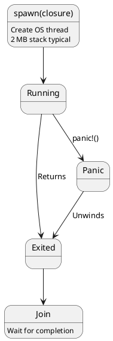
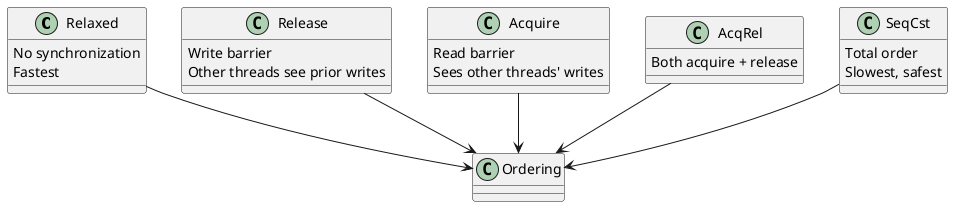
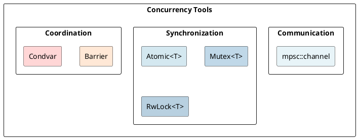

# Concurrency: Threads, Channels, Atomics, Memory Ordering Under the Hood

## Overview

Rust's concurrency model guarantees **thread safety** through Send/Sync traits and **memory safety** through ownership. Synchronization primitives build on these foundations.

---

## 1. Threads and OS-Level Parallelism

```rust
use std::thread;

let handle = thread::spawn(|| {
    println!("Hello from thread");
});

handle.join().expect("Thread panicked");
```

### Thread Lifecycle



---

## 2. Send and Sync Traits

```rust
// Send: ownership can be transferred across threads
// Sync: &T can be shared between threads safely

// String is Send
fn use_in_thread<T: Send>(t: T) {
    thread::spawn(move || { println!("{:?}", t); });
}

// Arc<T> is Sync if T: Send + Sync
fn use_shared<T: Sync>(t: &T) {
    thread::spawn(move || { println!("{:?}", t); });
}
```

| Type | Send | Sync |
|------|------|------|
| Primitives (`i32`, `bool`) | ✓ | ✓ |
| `String`, `Vec<T>` | ✓ (if T: Send) | ✓ (if T: Sync) |
| `Arc<T>` | ✓ | ✓ (if T: Send+Sync) |
| `Rc<T>` | ✗ | ✗ |
| `RefCell<T>` | ✗ | ✗ |
| `Mutex<T>` | ✓ | ✗ |

---

## 3. Channels: MPSC Communication

```rust
use std::sync::mpsc;

let (tx, rx) = mpsc::channel();

thread::spawn(move || {
    tx.send(42).unwrap();
});

let value = rx.recv().unwrap();
println!("{}", value);
```

### Multiple Producers

```rust
let (tx, rx) = mpsc::channel();
let tx1 = tx.clone();
let tx2 = tx.clone();
// All senders can send to the same channel
```

---

## 4. Atomics: Lock-Free Synchronization

```rust
use std::sync::atomic::{AtomicU32, Ordering};

let counter = AtomicU32::new(0);

thread::spawn(|| { counter.fetch_add(1, Ordering::SeqCst); });
thread::spawn(|| { counter.fetch_add(1, Ordering::SeqCst); });

// Result: 2 (no race condition)
```

### Memory Ordering



---

## 5. Mutex vs Atomics

```
AtomicU64::fetch_add:    1-2 cycles
Mutex::lock (uncontended): 10-100 cycles
Mutex::lock (contended):  100+ cycles (context switch)
```

---

## 6. RwLock: Read-Write Synchronization

```rust
use std::sync::RwLock;

let data = RwLock::new(vec![1, 2, 3]);

// Multiple readers simultaneously
let read_guard1 = data.read().unwrap();
let read_guard2 = data.read().unwrap();
// Writer blocks until all readers drop
```

---

## 7. Barrier Synchronization

```rust
use std::sync::Barrier;

let barrier = Arc::new(Barrier::new(3));  // Wait for 3 threads

for _ in 0..3 {
    let b = Arc::clone(&barrier);
    thread::spawn(move || {
        b.wait();  // Wait for all 3
        println!("All threads reached");
    });
}
```

---

## 8. Performance Characteristics

```
Creating thread:       1-10 ms (OS scheduling)
Atomic operation:      1-10 cycles
Channel send:          50-500 cycles
Mutex lock:            10-1000 cycles
Context switch:        100-10,000 cycles
```

---

## Summary Diagram



---

**Next:** [[cs/rust/18-rayon|Rayon]] — Learn data-parallelism with work-stealing
