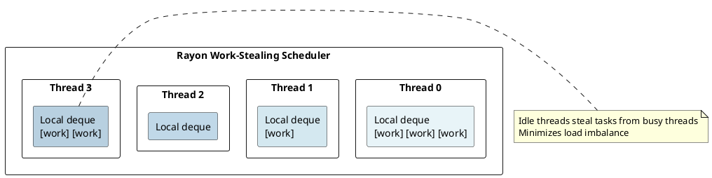
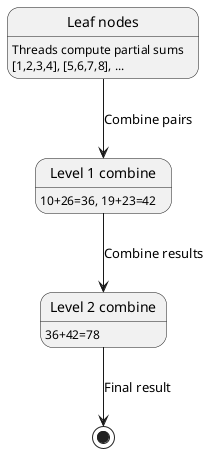
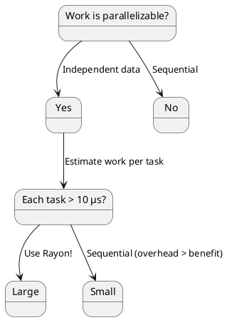

# Rayon: Data Parallelism with Work-Stealing Under the Hood

## Overview

Rayon provides **data-parallel** abstractions using a **work-stealing scheduler**. Unlike Tokio (task-parallel, async), Rayon targets **CPU-bound parallel computations** with declarative API that parallelizes iterators automatically.

---

## 1. Parallelism vs Concurrency

### Parallelism (Rayon)

```rust
use rayon::prelude::*;

let sum: i32 = (1..1000)
    .into_par_iter()
    .map(|x| x * x)
    .sum();
```

**Characteristics:**
- Multiple threads execute **simultaneously**
- Work on **independent data**
- **CPU-bound** (compute-intensive)

### Concurrency (Tokio)

**Characteristics:**
- Single or few threads **interleave** work
- **I/O-bound** (I/O-intensive)

---

## 2. Rayon Work-Stealing Scheduler

### Thread Pool

```rust
use rayon::prelude::*;

let pool = rayon::ThreadPoolBuilder::new()
    .num_threads(4)
    .build()
    .unwrap();

pool.install(|| {
    (0..100).into_par_iter().for_each(|i| println!("{}", i));
});
```

### Work-Stealing Queue Structure



---

## 3. Iterator Parallelization

```rust
use rayon::prelude::*;

// Sequential
let result: Vec<i32> = (0..1000).iter().map(|x| x * 2).collect();

// Parallel
let result: Vec<i32> = (0..1000).into_par_iter().map(|x| x * 2).collect();
```

### Work Division

```
Iteration 0-249:   Thread 0
Iteration 250-499: Thread 1
Iteration 500-749: Thread 2
Iteration 750-999: Thread 3
```

### Dynamic Load Balancing

```
If Thread 0 finishes early:
  Thread 0: [] ← Idle → steals work from Thread 1
```

---

## 4. Join and Fork

```rust
use rayon::prelude::*;

let (left, right) = rayon::join(
    || expensive_left_computation(),
    || expensive_right_computation()
);
// left and right computed in parallel
```

### Divide and Conquer: Merge Sort

```rust
fn merge_sort(v: &mut [i32]) {
    if v.len() <= 1000 {
        v.sort();
    } else {
        let mid = v.len() / 2;
        rayon::join(
            || merge_sort(&mut v[..mid]),
            || merge_sort(&mut v[mid..])
        );
    }
}
```

---

## 5. Reduction and Combine

```rust
use rayon::prelude::*;

let sum: i32 = (1..1000)
    .into_par_iter()
    .reduce(|| 0, |a, b| a + b);
```



---

## 6. Rayon vs Tokio

| Aspect | Rayon | Tokio |
|--------|-------|-------|
| **Best for** | CPU-bound parallelism | I/O-bound concurrency |
| **Scheduling** | Work-stealing | Event-driven |
| **Threads** | One per CPU core | Configurable |
| **Blocking** | Allowed (efficient) | Problematic (starves executor) |
| **Scalability** | O(cores) | O(tasks) |

---

## 7. Performance Characteristics

```
Parallel sum of 1 million numbers:
  Seq:   1000 ms
  Par:   250 ms (4 threads)
  Speedup: 4× (near-linear!)

Parallel send over channel:
  Seq:   100 ns
  Par:   10 μs (contention!)
  Slowdown: 100×
```

---

## 8. Decision Tree



---

## Summary

| Aspect | Rayon | Tokio |
|--------|-------|-------|
| **Best for** | CPU-bound parallelism | I/O-bound concurrency |
| **Scheduling** | Work-stealing | Event-driven |
| **Threads** | One per CPU core | Configurable |
| **Blocking** | Allowed (efficient) | Problematic (starves executor) |

---

**Next:** [[cs/rust/19-tokio|Tokio]] — Learn event-driven I/O architecture
