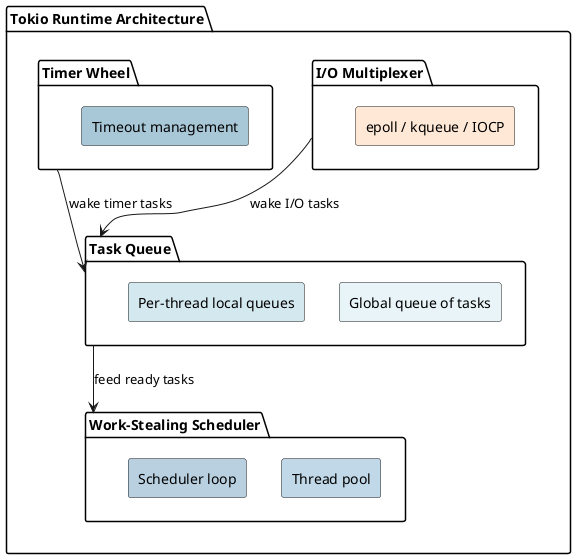
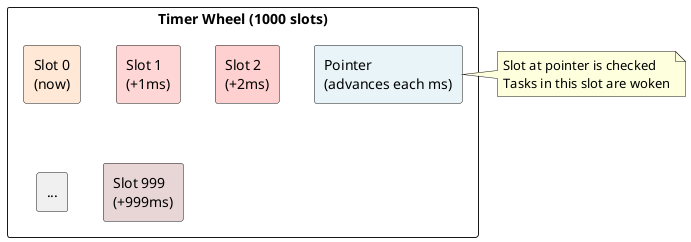

# Tokio Async Runtime: I/O Multiplexing and Scheduling Under the Hood

## Overview

Tokio is an **asynchronous runtime** built on top of Rust's Future trait. It provides sophisticated I/O multiplexing, work-stealing schedulers, and efficient resource management for high-concurrency applications.

---

## 1. What is a Runtime?

```rust
#[tokio::main]
async fn main() {
    // Runtime manages:
    // 1. Spawning and scheduling tasks
    // 2. Polling futures to completion
    // 3. I/O notifications (epoll, kqueue, IOCP)
    // 4. Timers and timeouts
}
```

**Without runtime:** Futures sit idle. Nobody calls `poll()`.

---

## 2. Tokio Architecture



---

## 3. Work-Stealing Scheduler

### Problem: Load Balancing

```
Thread 1: Busy with heavy task
Thread 2: Idle, nothing to do
CPU 2 is wasted!
```

### Solution: Work Stealing

```
Thread 1: Busy → keeps own work
Thread 2: Idle → steal from Thread 1's queue
```

---

## 4. I/O Multiplexing

### The Challenge

```
1000 concurrent connections
→ Can't create 1000 threads (too expensive)
→ Need single thread to monitor ALL connections
Solution: I/O multiplexing (epoll, kqueue, IOCP)
```

### Efficiency

```
Thread per connection:
- 1000 connections → 1000 threads → 2 GB stacks!

I/O multiplexing (1 thread, 1000 connections):
- Stack: 2 MB
- epoll_wait: O(1) notification
```

---

## 5. Timer Wheel

### Problem: Many Timeouts

```
Naive: sorted list → Insert O(n), check O(n)
10,000 timeouts → slow!
```

### Solution: Ring Buffer

```
Slot 0: Tasks expiring now
Slot 1: Tasks expiring in 1 ms
...
Slot 999: Tasks expiring in 999 ms

Insert: O(1) | Check: O(1) per tick
```



---

## 6. Task Spawning

```rust
tokio::spawn(async {
    // Runs independently on thread pool
});
```

**Task lifecycle:** spawn → enqueue → pick → poll → pending/ready → wake/complete

---

## 7. Runtime Configuration

```rust
// Multi-threaded (default)
#[tokio::main]
async fn main() { }

// Single-threaded
#[tokio::main(flavor = "current_thread")]
async fn main() { }

// Custom
use tokio::runtime;
let rt = runtime::Builder::new_multi_thread()
    .worker_threads(4)
    .thread_name("worker")
    .build()?;
```

---

## 8. Blocking Operations

```rust
// CPU-bound work blocks executor!
async fn process() {
    let result = tokio::task::block_in_place(|| {
        expensive_computation()  // Scheduler handles blocking
    });
}
```

---

## 9. Efficiency

```
Per task:
- Future state: ~100-1000 bytes
- Task metadata: 64 bytes
- No separate stack

1 million tasks: ~100 MB (reasonable!)
1 million threads: ~2 TB (impossible!)
```

---

## 10. Performance: Sync vs Async

```
Sync Server (threads):
- 1000 connections → 1000 threads → 2 GB memory

Async Server (Tokio):
- 1000 connections → 4-8 threads → 2 MB stacks
- Throughput: 100-1000× higher
```

---

## Summary

| Component | Purpose | Technique |
|-----------|---------|-----------|
| **Scheduler** | Fair task distribution | Work-stealing |
| **I/O Multiplexing** | Monitor thousands of fds | epoll/kqueue |
| **Timer Wheel** | Efficient timeouts | Ring buffer |
| **Task Queue** | Store pending work | Lock-free deque |

---

**Next:** [[cs/rust/20-macros|Macros]] — Learn metaprogramming and code generation
