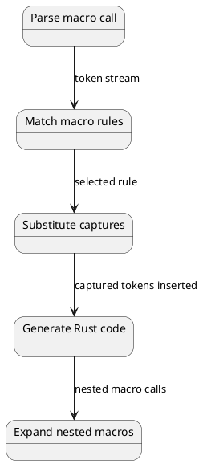
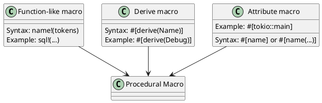

# Macros: Metaprogramming and Code Generation Under the Hood

## Overview

Rust macros are **code generation** systems that expand at compile time before type checking. Two types exist: **declarative macros** (pattern matching) and **procedural macros** (functions that manipulate token trees).

---

## 1. Declarative Macros (Macro Rules)

### Simple Macro Definition

```rust
macro_rules! println {
    ($($arg:tt)*) => {
        $crate::io::_print($crate::format_args!($($arg)*));
    };
}
```

### Macro Expansion Process



---

## 2. Token Trees

```rust
println!("hello", x, y + 2);

// Tokens:
// Identifier: println, Punctuation: !
// Literal: "hello", Punctuation: ,
// Identifier: x, Identifier: y
// Punctuation: +, Literal: 2
```

---

## 3. Capture Groups and Repetition

```rust
macro_rules! repeat {
    ($item:expr, $($repeat:expr),*) => {
        // $($repeat),* matches comma-separated expressions
        // * = zero or more, + = one or more, ? = zero or one
    };
}

repeat!(value, a, b, c, d);  // item=value, repeat=[a,b,c,d]
```

### Fragment Specifiers

| Specifier | Matches | Example |
|-----------|---------|---------|
| `item` | Function, struct, module | `fn foo() {}` |
| `block` | A block `{ ... }` | `{ let x = 1; }` |
| `stmt` | A statement | `let x = 1;` |
| `expr` | An expression | `x + 1` |
| `ty` | A type | `Vec<i32>` |
| `ident` | An identifier | `my_variable` |
| `tt` | Single token tree | Any single token |

---

## 4. Vec Macro Expansion Example

```rust
vec![1, 2, 3];

// Expands to:
{
    let mut _v = Vec::new();
    _v.push(1);
    _v.push(2);
    _v.push(3);
    _v
}
```

---

## 5. Procedural Macros

### Three Types



### Derive Macro

```rust
#[proc_macro_derive(MyTrait)]
pub fn derive_my_trait(input: TokenStream) -> TokenStream {
    let item = parse_macro_input!(input as DeriveInput);
    let name = &item.ident;
    quote! {
        impl MyTrait for #name { }
    }.into()
}
```

---

## 6. Macro Hygiene

```rust
macro_rules! bad_macro {
    ($body:expr) => {
        let x = 1;
        $body  // If $body contains x, it's accidentally captured!
    };
}

let x = 10;
bad_macro!(println!("{}", x));  // Prints 1, not 10!
```

---

## 7. Built-in Macros

```rust
file!()         // Current file name
line!()         // Current line number
column!()       // Current column
stringify!()    // Convert tokens to string
concat!()       // Concatenate strings at compile time
env!("PATH")    // Environment variable at compile time
```

---

## 8. Performance: Macros vs Functions

```
Macro expansion: Happens at compile time (no runtime cost)
Result: Often better than function (inlining opportunity)
```

---

## Summary

| Aspect | Declarative | Procedural |
|--------|-------------|-----------|
| **Define** | `macro_rules!` | `#[proc_macro]` |
| **Pattern Matching** | Yes | No (uses Syn crate) |
| **Type Access** | No | Yes (via Syn) |
| **Hygiene** | Automatic | Manual (`quote!`) |
| **Learning Curve** | Moderate | Steep |

---

**Next:** [[cs/rust/21-optimization|Optimization]] — Learn compiler optimizations
