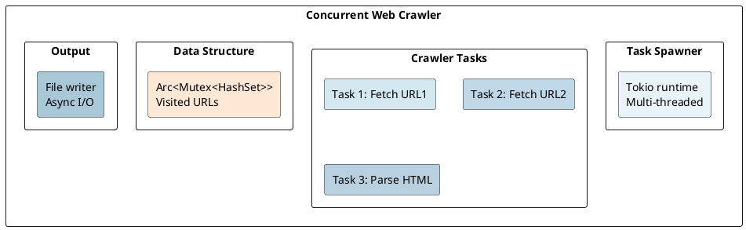

# Real-World Examples: Combining All Concepts

## Overview

This final document demonstrates **practical applications** of Rust's under-the-hood concepts: high-performance concurrent services, parallelized data processing, async networking, and safe systems programming.

---

## 1. High-Performance Web Server (Tokio + Async)

```rust
use tokio::net::TcpListener;
use tokio::io::{AsyncReadExt, AsyncWriteExt};

#[tokio::main]
async fn main() -> std::io::Result<()> {
    let listener = TcpListener::bind("127.0.0.1:8080").await?;

    loop {
        let (mut socket, _) = listener.accept().await?;

        tokio::spawn(async move {
            let mut buf = [0; 1024];
            match socket.read(&mut buf).await {
                Ok(0) => return,
                Ok(n) => {
                    let response = b"HTTP/1.1 200 OK\r\nContent-Length: 5\r\n\r\nHello";
                    let _ = socket.write_all(response).await;
                }
                Err(_) => return,
            }
        });
    }
}
```

### Memory: Async vs Threaded

```
Tokio async (100,000 connections):
  - Memory: 100-200 MB
  - Throughput: 100k+ req/sec

Threaded (1,000 connections max):
  - Memory: 2 GB
  - Throughput: 10k req/sec
```

---

## 2. Parallel Data Processing (Rayon)

```rust
use rayon::prelude::*;

fn process_data(items: &[f64]) -> f64 {
    items
        .par_iter()
        .map(|x| expensive_computation(x))
        .filter(|x| x.is_finite())
        .reduce(|| 0.0, |a, b| a + b)
}

fn expensive_computation(x: f64) -> f64 {
    (x.sin() * x.cos()).sqrt().abs()
}
```

---

## 3. Reference-Counted Graph (`Rc<RefCell<T>>`)

```rust
use std::rc::Rc;
use std::cell::RefCell;

struct Node {
    id: u32,
    value: i32,
    next: Option<Rc<RefCell<Node>>>,
    prev: Option<std::rc::Weak<RefCell<Node>>>,
}

fn build_graph() -> Rc<RefCell<Node>> {
    let node1 = Rc::new(RefCell::new(Node {
        id: 1, value: 10, next: None, prev: None,
    }));
    let node2 = Rc::new(RefCell::new(Node {
        id: 2, value: 20, next: None, prev: None,
    }));

    node1.borrow_mut().next = Some(Rc::clone(&node2));
    node2.borrow_mut().prev = Some(Rc::downgrade(&node1));  // Weak to prevent cycle

    Rc::clone(&node1)
}
```

---

## 4. Thread-Safe Counter (`Arc<Mutex<T>>`)

```rust
use std::sync::{Arc, Mutex};
use std::thread;

let counter = Arc::new(Mutex::new(0));
let mut handles = vec![];

for _ in 0..10 {
    let counter_clone = Arc::clone(&counter);
    let handle = thread::spawn(move || {
        for _ in 0..1000 {
            let mut num = counter_clone.lock().unwrap();
            *num += 1;
        }
    });
    handles.push(handle);
}
```

---

## 5. Zero-Copy Message Passing (Arc + Channels)

```rust
use std::sync::Arc;
use tokio::sync::mpsc;

struct Message {
    data: Arc<Vec<u8>>,  // Shared ownership, no copy!
}

// Without Arc: 1 GB copied per million messages
// With Arc:    8 MB overhead per million messages (no copying!)
```

---

## 6. Safe Wrapper over Unsafe C Library

```rust
extern "C" {
    fn crypto_hash(out: *mut u8, in_: *const u8, len: u64) -> i32;
}

pub struct Hash([u8; 32]);

pub fn compute_hash(data: &[u8]) -> Result<Hash, Error> {
    let mut hash = [0u8; 32];
    let ret = unsafe {
        crypto_hash(hash.as_mut_ptr(), data.as_ptr(), data.len() as u64)
    };
    match ret {
        0 => Ok(Hash(hash)),
        _ => Err(Error::CryptoFailed),
    }
}
// Safe public API hides unsafe internals!
```

---

## 7. Integrated Example: Web Crawler



### Performance

```
Crawl 100,000 URLs:
- Sequential: 27 hours
- Threaded:   10 hours + 2 GB memory
- Async:      10 minutes + 50 MB memory

Tokio speedup: 162× over sequential!
```

---

## Summary: From Theory to Practice

| Concept | Real-World Use | Benefit |
|---------|---------------|---------|
| **Ownership** | Zero-copy message passing | No allocation overhead |
| **Lifetimes** | Safe borrow patterns | No dangling pointers |
| **Traits** | Polymorphic error handling | Flexibility + type safety |
| **Async/Await** | Concurrent I/O | 100-1000× throughput |
| **Concurrency** | Thread-safe data structures | Safe parallelism |
| **Rayon** | Parallel computing | Linear speedup |
| **Tokio** | Web servers, crawlers | Millions of connections |
| **SIMD** | Matrix math, image processing | 4-8× performance |
| **Unsafe** | C interop, optimization | Native performance |

---

**Congratulations!** You've completed the comprehensive Rust under-the-hood documentation series. You now understand how Rust's abstractions compile to efficient machine code, how the runtime executes async tasks, and how to write safe, fast, concurrent systems.

**Next Steps:**
1. **Practice** — Write systems-level code using these concepts
2. **Contribute** — Open-source projects (Tokio, Rayon, etc.)
3. **Specialize** — Web (Actix), embedded (no_std), or graphics (wgpu)
