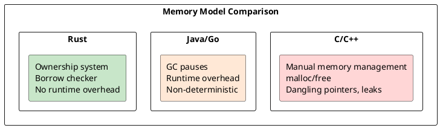

# Rust Programming

## What is Rust?

Rust is a **systems programming language** that runs blazingly fast, prevents segfaults, and guarantees thread safety. Key features:

- **Zero-cost abstractions** — high-level constructs compile down to efficient machine code
- **Move semantics** — ownership transfers without deep copies
- **Borrow checker** — compile-time memory safety with no garbage collector
- **Pattern matching** — destructuring enums, structs, and tuples
- **Fearless concurrency** — data races prevented at compile time

```rust
fn main() {
    println!("Hello, Rust!");
}
```

## Ownership in a Nutshell

```rust
let s = String::from("hello");  // s owns the String
let t = s;                       // Ownership moves to t
// println!("{}", s);            // ERROR: s no longer valid
```

## Borrowing in a Nutshell

```rust
let s = String::from("hello");
let r = &s;                      // Borrow (immutable)
println!("{}", r);               // OK: r reads s
```

## Core Concepts

| Concept | Description |
|---------|-------------|
| **Ownership** | Each value has exactly one owner |
| **Borrowing** | References without transferring ownership |
| **Lifetimes** | Compiler tracks reference validity |
| **Traits** | Shared behavior across types |
| **Patterns** | Destructuring and control flow |

## Memory Comparison



## Course Structure

This course covers Rust from first principles — how the compiler thinks, how memory works, and how to write safe, idiomatic code.

1. **[[cs/rust/02-fundamentals|Fundamentals]]** — Variables, mutability, shadowing, data types
2. **[[cs/rust/03-memory-management|Memory Management]]** — Stack, heap, ownership, moves, clones
3. **[[cs/rust/04-borrowing-references|Borrowing & References]]** — The borrow checker under the hood
4. **[[cs/rust/05-function-execution|Function Execution]]** — Call stack, closures, inlining
5. **Lifetimes** — Lifetime parameters and their enforcement
6. **Structs & Enums** — Custom data types and pattern matching
7. **Error Handling** — `Result`, `Option`, `?` operator
8. **Traits & Generics** — Polymorphism and code reuse
9. **Iterators & Closures** — Functional programming in Rust
10. **Smart Pointers** — `Box`, `Rc`, `RefCell`
11. **Concurrency** — Threads, `Send`, `Sync`
12. **Async Rust** — Futures, async/await, runtimes
13. **Unsafe Rust** — When and how to use `unsafe`
14. **FFI** — Interfacing with C
15. **Macros** — Declarative and procedural macros
16. **Testing** — Unit, integration, property-based testing
17. **Performance** — Profiling, benchmarking, optimization
18. **Patterns & Idioms** — Common Rust patterns
19. **Ecosystem** — Cargo, Crates.io, tools
20. **Real-world** — Building CLI, server, libraries
