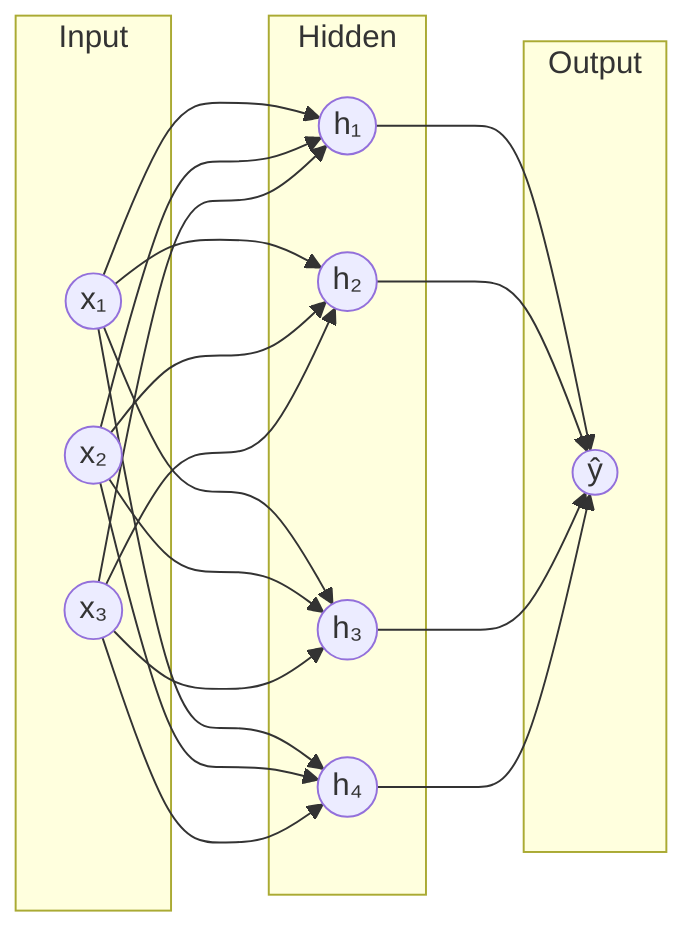

# Neural Networks

**Neural networks** are computing systems inspired by biological neural networks in the brain.

## Architecture

A neural network consists of layers of interconnected **neurons**:

- **Input layer**: receives raw data
- **Hidden layers**: transform data through weighted connections
- **Output layer**: produces the final prediction



## Forward Pass

Each neuron computes:

$$z = \sum_{i} w_i x_i + b$$

$$a = \sigma(z)$$

Where $\sigma$ is an activation function.

## Activation Functions

| Function | Formula | Range | Derivative |
|----------|---------|-------|------------|
| Sigmoid | $\sigma(x) = \frac{1}{1+e^{-x}}$ | (0, 1) | $\sigma(x)(1-\sigma(x))$ |
| Tanh | $\tanh(x) = \frac{e^x-e^{-x}}{e^x+e^{-x}}$ | (-1, 1) | $1-\tanh^2(x)$ |
| ReLU | $\text{ReLU}(x) = \max(0, x)$ | [0, ∞) | $0 \text{ if } x<0, 1 \text{ if } x>0$ |
| Softmax | $\sigma(z)_i = \frac{e^{z_i}}{\sum_j e^{z_j}}$ | (0, 1) | $s_i(\delta_{ij} - s_j)$ |

## Backpropagation

Backpropagation computes gradients of the loss with respect to weights using the **chain rule**:

$$\frac{\partial L}{\partial w_{ij}^{(l)}} = \frac{\partial L}{\partial a_j^{(l)}} \cdot \frac{\partial a_j^{(l)}}{\partial z_j^{(l)}} \cdot \frac{\partial z_j^{(l)}}{\partial w_{ij}^{(l)}}$$

```python
def backward(self, X, y, output):
    m = X.shape[0]
    self.dz2 = output - y
    self.dW2 = (1/m) * self.a1.T @ self.dz2
    self.db2 = (1/m) * np.sum(self.dz2, axis=0, keepdims=True)
    self.dz1 = self.dz2 @ self.W2.T * (self.a1 * (1 - self.a1))
    self.dW1 = (1/m) * X.T @ self.dz1
    self.db1 = (1/m) * np.sum(self.dz1, axis=0, keepdims=True)
```

## Universal Approximation Theorem

A feedforward network with a single hidden layer containing enough neurons can approximate any continuous function to arbitrary accuracy.

## See Also

- [[ds/machine-learning/regression|Regression]] — linear models as building blocks
